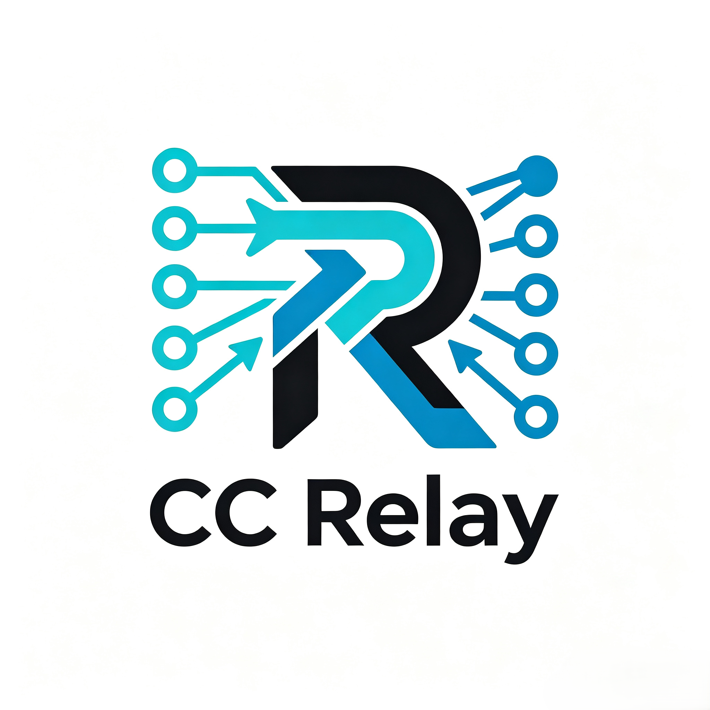

<p align="center">
  
</p>

# CC Relay 技能运行时

## 快速使用指南

### 1. 下载一次性引导包

只需从 Release 下载 `ccrelay-bootstrap.zip`，不需要手动下载完整包或 Gitee 分卷。

- 国内网络优先使用 [Gitee Release](https://gitee.com/nekoneko-acg/ccrelay/releases)
- 也可以使用 [GitHub Latest Release](https://github.com/LastEmbryo2950618641/ccrelay/releases/latest)

### 2. 在 Codex 或 Claude Code 中安装引导包

将下载好的 `ccrelay-bootstrap.zip` 提供给 Codex 或 Claude Code，然后输入：

```text
帮我安装 Skill ccrelay-bootstrap.zip
```

### 3. 使用引导包安装完整 CC Relay

引导 Skill 安装完成后输入：

```text
/ccrelay 帮我安装完整 CC Relay
```

随后按照会话中的指引操作。引导 Skill 会优先从 Gitee 下载、恢复并校验完整包；失败时自动回退 GitHub。下载完成后，引导 Skill 会被完整 CC Relay Skill 覆盖。

Windows 安装支持 Windows PowerShell 5.1 或 PowerShell 7 及以上版本，不支持 PowerShell 3、4、5.0 和 6。

### 4. 查看节点状态或部署 CC Relay

查看远端机器负载：

```text
/ccrelay 帮我查看 IP1 与 IP2 机器的负载
```

将 CC Relay 部署到多个节点：

```text
/ccrelay 帮我部署到节点 IP1、IP2 与 IP3
```

首次部署时，按照会话指引完成 SSH 凭据、专用账户和模型配置。

### 5. 使用多 Agent 协作讨论

```text
/ccrelay 请讨论中美之间的差异，并讨论谁更强
```

CC Relay 会根据问题选择合适的协作方式，让多个远端 Agent 共同分析并汇总结论。

### 6. 使用多 Agent 协作排查任务

```text
/ccrelay 请帮我查看 YARN 任务 application_id 为什么失败
```

请将 `application_id` 替换为实际的 YARN Application ID。远端 Agent 会根据可访问节点上的日志、命令结果和上下文协作定位问题。

CC Relay 是面向所有支持标准 Skill 的 AI 产品的远端多 Agent 协作控制面。

- 单一本地 jar 运行时
- 使用本地 SQLite 持久化
- 提供 relay 注册、心跳与授权能力
- 提供 A2A 消息与异步任务能力
- 提供通用远端多 Agent 组网编排命令，不绑定具体业务域
- 远端 Agent 目标默认 ReAct 执行，当前远端异步任务已启用 Java 托管 Runner，支持步数、命令白名单、超时、审计、AI 开关，以及运行中注入、调参、停止
- 多节点 fanout 默认异步创建任务，并提供逐节点状态兜底，不同步等待所有节点完成
- 任务观测支持 `task observe` / `agent observe` 窗口化读取，支持单任务、批量任务和父任务聚合
- 为远端 A2A 任务提供本地影子任务持久化
- 真实交互由远端 relay 执行；本地运行时默认不执行 CC 对话
- 真实 AI 链路需要先生成 `cc-model-config.yml`，mock 响应不等同于完整模型调用验收
- 全局配置支持 `config get|set|unset|list|reload|history` 与 `config secret get|set`，普通配置不得明文返回密钥

## 标准 Skill 包

- 技能源目录：`codex-skill/ccrelay`
- 统一打包完整 Skill 与一次性引导 Skill（Linux/macOS shell）：`bash build.sh`
- 统一打包完整 Skill 与一次性引导 Skill（Windows PowerShell）：`powershell -ExecutionPolicy Bypass -File build.ps1`
- 打包后的技能输出：`dist/skill/ccrelay`
- 完整 Skill ZIP：`dist/release/ccrelay-full.zip`
- 一次性引导 Skill ZIP：`dist/release/ccrelay-bootstrap.zip`
- 技能内置运行时位置：`dist/skill/ccrelay/assets/runtime-bundle/ccrelay`
- 校验技能：`powershell -ExecutionPolicy Bypass -File scripts/validate_codex_skill.ps1`
- 安装源目录到本地 Skill 目录：`powershell -ExecutionPolicy Bypass -File scripts/install_codex_skill.ps1 codex-skill/ccrelay --force`
- 安装打包后的 Skill：`powershell -ExecutionPolicy Bypass -File scripts/install_codex_skill.ps1 dist/skill/ccrelay --force`

- 从旧版 `wdsavs-ai-agent-runtime` 升级时，安装器会迁移 `.local` 中的中心配置、SSH 凭据和身份状态到 `skills/ccrelay`，成功后删除旧 Skill 目录。
- 自动化校验、安装与回归：`powershell -ExecutionPolicy Bypass -File scripts/test_codex_skill_flow.ps1`
- CC 配置模板：`codex-skill/ccrelay/assets/config-templates/cc-model-config.template.yml`
- CC 配置生成与连通测试：Windows 使用 `scripts/prepare-cc-config.ps1 --discover`，Linux 使用 `scripts/prepare-cc-config.sh --discover`；发布包使用内置 Python 3.13。
- DeepSeek Claude Code 默认使用官方 Anthropic 兼容服务地址与消息通道。
- 命令封装：标准调用方式在 skill 目录内，安装后使用 `<CLI> --help`
- 开发仓库中可直接使用 `powershell -ExecutionPolicy Bypass -File codex-skill/ccrelay/scripts/ccrelay-cli.ps1 --help`
- 全局 `ccrelay-cli` 仅是可选快捷别名，不作为标准 Skill 依赖。
- CLI 中文手册：`docs/commands/ccrelay-cli.md`

## 集群 Prompt 管理

固定 Prompt 由 CC Center 统一管理，Relay 随心跳同步并在任务开始前校验完整 revision：

```bash
<CLI> prompt install ./shared-rules.md --id shared-rules --type UNIFIED --order 10
<CLI> prompt install ./evidence-check.md --id evidence-check --type PRE --order 20
<CLI> prompt install ./final-review.md --id final-review --type POST --order 10
<CLI> prompt list
<CLI> prompt remove final-review
```

- `UNIFIED` 位于 Relay 固定安全职责之后、共享最终回复上下文之前；内容或顺序变化时 Relay 旋转私有模型 Session 并重放 Center 共享上下文。
- `PRE` 在每个 Agent 正式 ReAct 前按 `order` 注入，同一任务 attempt 的模型重试不会重复注入。
- `POST` 在正常 ReAct 产生私有候选后触发第二次模型定稿；定稿阶段禁用工具与节点协作，只有成功的第二阶段答案进入共享上下文。
- 三种类型都按 `order ASC, promptId ASC` 排序。同一任务固定使用一个 Prompt revision，执行期间的目录更新只影响后续任务。

## GitHub Actions 构建

仓库内置 `.github/workflows/build-skill-zip.yml`：

- 本地构建与 GitHub Actions 调用同一个打包器，统一生成 `ccrelay-full.zip` 和 `ccrelay-bootstrap.zip`，并分别生成 SHA-256 文件。
- `ccrelay-full.zip` 是包含 JAR、Windows/Linux JRE、内置 Python、Claude Code 和全部脚本的完整自包含 Skill。
- `ccrelay-bootstrap.zip` 是一次性引导 Skill；首次使用时下载并校验完整包，覆盖自身后立即按完整 Skill 继续工作，不承担后续版本检查。
- 引导 Skill 默认优先从 Gitee 的 `latest` Release 下载完整包和 SHA-256，下载或校验失败时自动整体回退 GitHub Latest Release。
- 在 Actions 页面手动选择目标版本分支并运行工作流时，同一次运行会完成测试、打包、按 `build.gradle` 版本更新同名 `v*` 标签、创建或更新 GitHub Release、上传两类 ZIP 及校验文件，并将该版本设为 Latest Release。版本分支和标签推送均不会重复触发发布构建；普通 `main` 推送只执行构建验证。两个 ZIP 解压后的顶层目录均为 `ccrelay/`。
- GitHub 手动发布只负责 GitHub Release；国内完整包发布改由 Gitee Go 在 Gitee 侧本地构建，避免跨网直传大文件到 Gitee Release。

## 任务观测

- `task observe` / `agent observe` 是默认观测入口，不等同于任务终态查询
- `events` 只查历史事件，`events/stream` 只做实时订阅
- 批量观测支持 `taskIds` 和 `parentTaskId`
- 远端不可达时返回中心兜底视图，并标记 `CENTER_FALLBACK`

## 在线配置

- 在线配置只允许白名单 key 修改
- `dynamic` 表示修改后立即生效
- `restartRequired` 表示保存后需重启生效
- `secret` 只能走专门命令族更新，普通 `config set|unset` 必须拒绝
- 配置变更必须写审计

## 远端验收

- 远端验收计划：`docs/testing/2026-07-28_remote-ssh-external-acceptance-plan.md`
- 配置模板：`scripts/remote_acceptance_config.template.json`
- 本地预检：`powershell -ExecutionPolicy Bypass -File scripts/remote_acceptance_preflight.ps1 -ConfigPath scripts/remote_acceptance_config.json`
- 未指定远端目录时，默认使用 `/home/<username>/ccrelay`
- 已注册 Relay 的历史工作目录继续有效；改名只影响新部署的默认目录，不强制搬迁运行中的节点。
- 构建运行时制品包：`powershell -ExecutionPolicy Bypass -File scripts/build_runtime_bundle.ps1`
- 远端启动脚本：`scripts/install-relay.sh`

## 运维文档

- 运维索引：`docs/operations/README.md`
- 交付接手入口：`docs/operations/2026-07-30_交付清单与接手入口.md`
- 上线发布说明：`docs/operations/2026-07-29_go-live-release-notes.md`
- 运维手册：`docs/operations/2026-07-29_operations-runbook.md`
- 部署指南：`docs/operations/2026-07-29_deployment-guide.md`
- 最终上线手册：`docs/operations/2026-07-29_最终上线手册.md`

## 一键检查

- 基线巡检：`powershell -ExecutionPolicy Bypass -File scripts/check_remote_baseline.ps1`
- 最终验收：`powershell -ExecutionPolicy Bypass -File scripts/run_final_acceptance.ps1`
- CLI 自测：`py -3 scripts/test_ccrelay_cli.py`

## 验收等级

- `L0_SKILL_FORMAT`：标准 Skill 格式与构建产物。
- `L1_LOCAL_CONTROL`：本地 runtime 与控制面基础命令。
- `L2_REMOTE_RELAY`：远端 relay 注册、心跳与发现。
- `L3_A2A_MOCK`：跨节点 A2A mock 闭环。
- `L4_REMOTE_AI_WEAK_REACT`：真实模型调用 + 弱约束 ReAct。
- `L5_JAVA_ENFORCED_REACT`：Java 托管 Runner 强制执行结构化 ReAct 动作、步数、白名单、超时、注入、调参、停止和审计。
