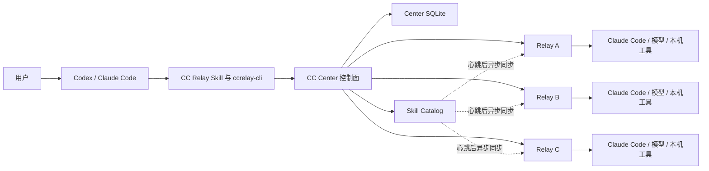
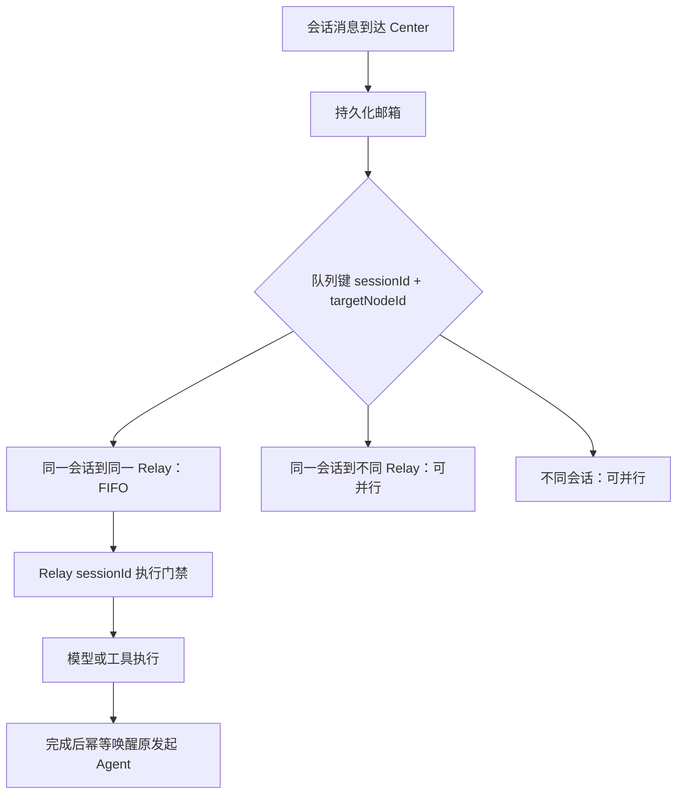

# CC Relay：面向远端多 Agent 协作的分布式控制面设计与实践

> 多 Agent 的价值不在于让多个模型分别回答同一个问题，而在于让它们围绕同一个目标共享事实、分工执行、互相追问，并形成可以验证的共同结论。

## 项目地址

- GitHub：[LastEmbryo2950618641/ccrelay](https://github.com/LastEmbryo2950618641/ccrelay)
- GitHub Release：[下载最新版本](https://github.com/LastEmbryo2950618641/ccrelay/releases/latest)
- Gitee：[nekoneko-acg/ccrelay](https://gitee.com/nekoneko-acg/ccrelay)
- Gitee Release：[国内镜像下载](https://gitee.com/nekoneko-acg/ccrelay/releases)

## 引言

当我们同时向三个 AI 节点提问时，最容易实现的方案是把同一段 Prompt 并行发送三次，再把三份回答拼到一起。这种方式能够增加答案数量，却没有真正建立协作关系：节点之间不知道彼此说了什么，无法追问证据，也没有一个节点负责收敛分歧。

如果进一步允许 Agent 在远端机器上读取日志、执行命令或部署服务，问题会迅速从“如何调用模型”变成一个分布式系统问题：

- 会话上下文由谁保存，多个节点如何读取一致的历史？
- 同一节点忙碌时，新消息是丢弃、重试，还是排队？
- 谁是协调者，协调者是否也能执行任务？
- 工具权限、超时、停止和审计由 Prompt 约束，还是由代码强制？
- 一个包含几十个节点的集群，如何完成账号、SSH、制品和模型配置准备？
- 部分节点失败后，是自动忽略、无限重试，还是让用户基于原因作出治理决策？
- 自定义 Skill 如何可靠地同步到所有 Relay，并保证内容完全一致？

CC Relay 正是围绕这些问题构建的远端多 Agent 协作控制面。它不试图发明新的大模型，而是为 Codex、Claude Code 等支持 Skill 的 AI 产品提供一套可安装、可部署、可观测、可控制和可审计的远端协作运行时。

## 1. 从“多次调用”到“协作系统”

一个真正的多 Agent 协作系统至少需要四层能力。

第一层是**连接**。系统要知道有哪些 Relay 节点、它们是否在线、具备哪些能力，以及如何安全访问。

第二层是**会话**。所有参与者必须围绕同一份权威上下文工作，而不是各自保存一套可能分叉的聊天记录。

第三层是**编排**。系统需要选择协调者、区分独立执行和共同讨论、维护消息顺序，并在节点忙碌时继续推进任务。

第四层是**执行治理**。当 Agent 调用命令或修改远端环境时，步数、权限、超时、停止、审计和秘密保护必须由运行时代码落实，不能仅依赖模型“自觉遵守”。

CC Relay 的定位可以概括为：

> 以 CC Center 为权威控制面，以 Relay 为远端执行节点，以标准 Skill 为操作入口，为多个 Agent 提供共享会话、任务编排、受控执行和集群交付能力。

## 2. 整体架构

CC Relay 的核心组件包括调用端 AI、CC Center、远端 Relay、模型执行后端和 Skill 目录。



### 2.1 调用端 AI

调用端 AI 是用户交互入口。它负责理解用户目标、调用当前 Skill 目录中的 `ccrelay-cli`、展示结构化引导、反馈部署进度，并把最终协作结果交还用户。

它不是 CC Center，也不是远端协调 Agent。会话中的协调者由 Center 从首批健康参与节点中选择并持久化，调用端不能通过 Prompt 擅自改写这一角色。

### 2.2 CC Center

Center 是整个系统的权威控制面，负责：

- Relay 注册、心跳和节点状态；
- 会话、参与者、协调者和共享上下文；
- 授权、路由、任务和事件；
- 会话消息队列与恢复唤醒；
- SSH 身份能力摘要和部署记录；
- Skill 目录、制品和一致性摘要；
- Web UI 和 CLI 所需的只读观测数据。

Center 使用 SQLite 保存权威状态。客户端本地只保存引导阶段、配置、凭据引用和必要游标，不复制一套会话或任务数据库。

### 2.3 Relay

Relay 是部署在远端节点上的协作执行入口。它接收 Center 路由的工作请求，按游标同步会话上下文，注入统一职责提示词，然后调用模型或本机工具完成任务。

Relay 不自行维护另一份可编辑的全局会话，也不根据普通文本中的 `@节点` 自动唤醒其他 Agent。主动追问必须通过 `ccrelay-cli` 回到 Center，由控制面完成授权、落账、路由和幂等处理。

## 3. 权威共享上下文：多 Agent 协作的基础

多 Agent 最容易被低估的问题是上下文一致性。

如果 Center 把完整历史复制到每个节点，并允许各节点自行更新本地副本，那么多个 Agent 很快会基于不同版本的历史回答。CC Relay 采用事件账本和游标同步模型：一个会话只有一份由 Center 保存的权威上下文。

### 3.1 事件账本

Center 使用独立的会话上下文事件表保存模型可见事件，包括：

- 用户消息；
- Agent 可见回复；
- 调度和提及消息；
- 受控的工具结果摘要；
- 阶段性结论。

数据库递增 ID 同时充当会话游标。每个事件具有幂等 `eventId`，重复请求不会重复写入同一条消息。

API key、密码、授权 Token、隐藏推理、完整日志和大文件原文不得进入共享上下文。大对象只保存受控引用或裁剪后的摘要。

### 3.2 增量拉取而非全量推送

Relay 只有在被消息或任务唤醒时，才使用 `sessionId + lastAppliedCursor` 从 Center 拉取新增事件。这样既避免 Center 向所有节点广播完整历史，也减少模型每轮重复接收上下文的成本。

Relay 为 `nodeId + sessionId` 维护稳定的模型 Session。首次执行创建模型 Session，后续执行恢复同一 Session；Center 增量只补充新的跨节点事实。

这一设计要求严格区分三种状态：

1. Center 事件已经存在；
2. Relay 已经将事件应用到模型 Session；
3. 本轮 Agent 已经成功生成并写回结果。

不能把“模型 Session 已创建”与“本轮执行成功”合并成一个布尔值。否则首次请求在模型 Session 创建后因 API 错误失败，重试时仍可能错误地再次创建同一个 Session，最终由二次 Session 冲突覆盖真正的首次错误。

### 3.3 共享上下文也是 UI 的唯一聊天正文

任务事件和会话消息承担不同职责。共享上下文是聊天主时间线，任务事件是执行轨迹。

Web UI 不应把任务结果和已经写入共享上下文的 Agent 回复渲染成两条消息。正确做法是按 `taskId` 将工具调用、进度、重试和错误折叠到对应 Agent 回复下方：

```text
relay-a @ relay-b
最终回复内容……

▶ 执行过程 · 9 个步骤 · 2 次工具调用 · 12.4 秒
```

这样既保留可观测性，也不会让用户看到重复答案。

## 4. 协调者、参与者与协作模式

### 4.1 协调者不是另一种 Agent

所有 Relay 使用同一份产品级职责提示词。协调者和参与者不是两个不同软件，也不是两套模型权限，而是同一节点在当前会话中的运行时角色。

首次话题建立时，Center 从首批健康参与节点中随机选择协调者，并将 `coordinatorNodeId`、`coordinatorEpoch` 和参与者集合写入会话。后续该节点无论因用户消息还是其他 Agent 追问被唤醒，角色都从 Center 的权威会话数据恢复，不能因为本轮“被 @”就降级成普通参与者。

协调者仍然具备执行能力。它除了可以调用工具和完成子任务，还承担识别分歧、请求补充证据和形成共同结论的职责。

### 4.2 四种协作模式

当前实现定义了四种模式：

| 模式 | 适用场景 | 主要行为 |
| --- | --- | --- |
| `DIRECT` | 单节点任务 | 直接由目标 Agent 处理 |
| `INDEPENDENT_FANOUT` | 多节点分别检查或独立回答 | 一次性向多个节点创建异步任务，结果彼此独立 |
| `DISCUSSION` | 共同讨论、互审、形成共同结论 | 允许节点基于共享上下文追问和接力，由协调者收敛 |
| `SESSION_FOLLOW_UP` | 在既有会话中追加问题或加入节点 | 复用原会话、协调者和历史上下文 |

模式应根据用户意图选择，而不是让 Relay 临时猜测。用户明确要求“分别检查”时使用独立 fanout；明确要求“共同讨论”时使用讨论模式；继续既有话题时使用 follow-up。

讨论模式的验收标准也不能只是“每个节点回复一次”。至少应观察到真实跨节点消息、被询问节点作出针对性回应，以及协调者吸收关键分歧并形成结论。否则它仍然只是多个独立回答。

## 5. 队列语义：忙碌不能等于丢消息

远端 Agent 执行可能持续数分钟。如果 Relay 正忙时直接返回失败，而调用方又不知道是否应该重发，就会出现消息丢失或重复执行。

CC Relay 使用两层队列解决这一问题。



第一层是 Center 的持久化消息邮箱，队列键为 `sessionId + targetNodeId`。同一会话发往同一 Relay 的消息严格 FIFO；同一会话发往不同 Relay的任务可以并行，不同会话也可以并发。

第二层是 Relay 本机的 Session 执行门禁。它防止同一模型 Session 被并发修改，同时通过固定大小线程池允许多个不同会话并发运行。

当 Relay 返回 `BUSY` 时，Center 将消息保持在 `QUEUED` 或 `RETRY_WAIT`，后台扫描继续处理。调用方收到已排队状态后不得重复发送。讨论中的追问执行完毕后，Center 再通过幂等唤醒恢复原发起 Agent。

因此，同时 `@` 三个节点的行为既不是严格串行，也不是毫无关联的瞬时并行：分发可以快速完成，各目标并发处理；后续节点是否看到前序回复，取决于任务开始时拉取到的共享上下文游标和讨论编排，而不是分发循环的表面顺序。

## 6. ReAct 不能只写在 Prompt 里

如果 Agent 只能给观点，Prompt 约束通常已经足够；一旦 Agent 可以执行 Bash、读取文件或修改系统，仅依赖提示词就不可靠。

CC Relay 将 ReAct 控制循环托管到 Java 运行时：

- `ReactAgentRunner` 负责逐步读取动作和控制状态；
- `ReactCommandExecutor` 负责执行被允许的命令并强制单步超时；
- 运行策略控制最大步数、任务总时长、是否允许 AI、审计级别和输出限制；
- 运行中可以注入补充指令、调整控制参数或停止任务；
- 工具调用和结果写入任务事件，供审计与观测。

自然语言请求没有结构化动作时，可以通过 `ASK_AI` 走模型兜底。这能证明模型链路可用，却不能证明命令权限、步数和动作级安全约束已经被触发。项目因此将验收等级区分为本地控制、远端 Relay、A2A Mock、远端 AI 和 Java 强制 ReAct，而不是用一次“模型成功回复”替代完整验收。

## 7. 远端部署：从单机脚本到集群交付

远端多 Agent 系统最大的实际成本往往不在模型调用，而在环境准备。目标机器可能没有 Java、Python、Claude Code、标准 Skill 目录，甚至不同节点的 SSH 版本和账号权限也不一致。

### 7.1 自包含运行时

完整 CC Relay Skill 包含：

- 应用 JAR；
- Windows 和 Linux JRE 21；
- Windows 和 Linux 的最小 Python 3.13；
- Relay 启停和部署脚本；
- `ccrelay-cli` 平台包装入口；
- 模型配置模板与 Skill 管理能力。

CLI 优先使用包内 Python，不要求宿主机预装正确版本；Relay 启动优先使用包内 JRE，不修改用户 PATH，也不修复用户自己的 shell 配置。

### 7.2 三阶段引导状态

本地引导数据库只保存三个里程碑：

| 阶段 | 含义 |
| --- | --- |
| `UNINITIALIZED` | 尚未完成集群 SSH 准备 |
| `SSH_READY` | 选定账号模式要求的 SSH 能力已验证 |
| `DEPLOYED` | Center、Relay、心跳、模型和协作验收已完成 |

阶段库不保存密码、节点详情或模型密钥，也不通过扫描残余文件推断“可能已经部署”。这种设计避免 AI 依赖对话记忆猜测流程状态，同时保持状态模型足够简单。

### 7.3 Remote-first 部署链路

部署决策遵循以下顺序：

1. 已注册且健康的 Relay，直接使用；
2. 目标 Relay 不可用时，优先通过 `SELF_REPLICATE` 自复制；
3. 自复制因权限、网络或制品问题失败后，才使用 Center SSH 兜底。

SSH 是必要能力，但不是所有操作的默认第一跳。部署完成必须以注册成功、心跳正常和协作验证通过为准，不能以“脚本执行结束”作为成功标准。

### 7.4 中心选择与端口探测

首次部署时，如果本地 Center 无法被远端访问，系统从目标节点集合中探测 CPU、负载、内存、磁盘、写权限和 SSH 可达性，通过确定性评分选择更适合的远端 Center。

Center 端口和 Relay 端口由代码在配置范围内探测，启动前再次检查竞争。AI 负责理解用户目标和处理安全边界，不参与逐节点猜测空闲端口，避免节点数量增加后被模型调用延迟放大。

### 7.5 完整节点集合与批量并发

用户要求部署多个节点时，目标集合必须第一时间持久化。账号创建、密钥安装、Center 到节点验证和部署验收都基于同一完整集合，不能用单节点结果推断整个集群已经就绪。

批量部署使用独立子任务和显式并发上限。排队节点显示 `WAITING_BATCH_SLOT`，单目标失败不会阻塞其他目标，观测接口按输入顺序聚合结果。

这一模型适合中小规模集群，但还不是面向超大规模集群的动态源池、波次调度或自适应拥塞控制系统。

## 8. SSH 身份与信任拓扑

账号模式和 SSH 信任拓扑是两个不同维度。

系统可以创建 `ccrelay` 专用账号，也可以使用用户已有账号；无论使用哪种账号，都需要根据集群规模和部署方式选择验证能力。

### 8.1 FULL_MESH

`FULL_MESH` 表示节点之间的互信已经完整验证。任意具备制品的 Relay 可以直接向其他节点自复制，适合节点数量较少、需要节点间自主扩散的环境。

完整网状验证的信任边数量接近 `N × (N - 1)`。当节点规模增长时，其验证成本会快速上升。

### 8.2 CENTER_ONLY

`CENTER_ONLY` 表示 Center 到所有活动节点的 SSH 能力已经验证，但不要求节点之间彼此免密。它仍然支持 Center 管理的批量部署，只是不具备任意节点间直接自复制的前提。

因此，`CENTER_ONLY` 是验证后的能力状态，不是“是否创建专用账号”的选择。对于中型集群，它能够将 SSH 验证复杂度从平方级降到线性级。

### 8.3 兼容性与秘密保护

不同环境可能运行较旧的 OpenSSH。CC Relay 允许用户提供自定义 SSH 参数，并根据目标节点支持情况选择 ED25519 或 RSA 密钥，避免写死新版本才支持的参数。

SSH 密码只保存于 Skill 的 `.local` 目录。Windows 使用当前用户 DPAPI 保护，Linux 使用当前用户 `0600` 文件权限。密码不会进入 Center 数据库、任务 Payload、日志或最终回复。

## 9. 部分失败不是异常分支，而是常态

在几十个节点上执行账号创建或制品分发时，部分失败几乎不可避免：机器离线、密码不一致、sudo 权限不足、磁盘不足、账号密码策略不兼容、旧 SSH 参数不受支持，都会造成局部失败。

CC Relay 不把这些问题处理成无限自动重试，也不静默移除失败节点。正确流程是：

1. 等待当前批次所有目标进入终态；
2. 汇总账号创建、密钥安装、互信验证和 Relay 部署的失败原因；
3. 向用户展示成功节点和失败节点；
4. 由用户选择治理失败节点、排除失败节点后继续，或取消流程。

“治理失败节点”意味着根据具体原因调整凭据、权限、密码复杂度、SSH 参数或节点环境；“排除后继续”意味着明确缩小目标集合。两者都必须由用户决定，因为它们改变了安全配置或最终集群边界。

这种设计的关键不是增加更多重试，而是让失败成为可观察、可解释、可决策的状态。

## 10. Skill 集中管理与一致性同步

远端 Agent 要使用自定义 Skill，不能依赖用户逐台 SSH 复制目录。CC Relay 将 Center 设计为 Skill Catalog 的唯一权威来源。

### 10.1 安装流程

用户通过以下形式安装标准 Skill：

```text
ccrelay-cli skill install <skill-directory-or-zip>
```

CLI 校验根级 `SKILL.md`，生成确定性 ZIP 并计算文件树 SHA-256，然后只上传到 Center。Center 重新验证 Skill ID、结构和摘要，不信任客户端声明。

### 10.2 心跳后的异步收敛

Relay 每次心跳成功后触发一次非阻塞目录检查：

1. 获取 Center 的目录摘要；
2. 摘要未变化时立即结束；
3. 摘要变化时拉取完整目录快照；
4. 下载到 Claude 不可见的 staging 目录；
5. 解压并重新计算文件树 SHA-256；
6. 校验成功后原子替换正式目录，状态写为 `INSTALLED`；
7. Center 已失效或完整目录中不存在的 Skill，先写为 `INVALID`，再移出可见目录。

Relay 本地状态只有 `INSTALLING`、`INSTALLED` 和 `INVALID`。传输失败时保持 `INSTALLING` 并记录 `lastError`，下个心跳周期重试；只有 `INSTALLED` 的 Skill 才能被 Claude 使用。

### 10.3 为什么使用文件树 SHA-256

一致性摘要不依赖 ZIP 时间戳、宿主绝对路径或操作系统。系统按规范化相对路径排序，将路径长度、路径、内容长度和原始内容写入摘要输入。

因此，相同文件树在 Windows 和 Linux 上会得到相同 SHA-256。MD5 没有必要与 SHA-256 并存，一个强一致性标识即可同时承担内容校验和版本变化识别。

## 11. 一次性引导包与发布体系

完整 Skill 包含 JRE、Python、JAR 和跨平台脚本，体积较大。要求用户第一次就手工处理完整包、分卷和校验，会显著增加安装门槛。

项目因此同时发布两个制品：

- `ccrelay-full.zip`：完整、自包含的运行 Skill；
- `ccrelay-bootstrap.zip`：轻量的一次性安装入口。

用户先把引导包安装到 Codex 或 Claude Code，然后直接提出 CC Relay 任务。引导 Skill 会优先从 Gitee Latest Release 下载完整包；Gitee 使用 7-Zip 分卷时，引导包利用内置 7-Zip 恢复外层 ZIP并校验 SHA-256。Gitee 不可用时整体回退 GitHub Latest Release。

校验通过后，完整 Skill 覆盖当前 `ccrelay` 引导目录，同时保留 `.local` 中的阶段、配置和凭据数据。安装成功后，引导包失去作用，AI 重新读取完整 `SKILL.md` 并继续用户最初的请求。

本地构建、GitHub Actions 和 Gitee Go 使用统一打包逻辑，确保完整包和引导包具有相同目录约定与校验方式。

## 12. 可观测性：不能只看进程是否存在

长任务最危险的状态不是明确失败，而是“看起来还在运行，却没有任何进展”。

CC Relay 的部署和 Agent 任务通过事件与观测窗口反馈：

- 当前阶段和目标节点；
- 已完成数、总数、成功数和失败数；
- 已传输字节、总字节和滚动速度；
- 预计剩余时间和最近更新时间；
- 心跳状态、任务状态和 Center 兜底视图。

进程存在不能作为正常推进的证据。连续多个观测周期没有阶段、节点计数、字节数、日志或更新时间变化时，系统应明确说明“暂无新的可验证进展”；超过停滞阈值后标记 `STALLED` 并开始定位。

同样，模型自述“已经执行命令”也不能作为工具调用证据。验收必须以任务、事件、共享上下文和审计记录为准。

## 13. 安全边界

CC Relay 的安全模型不是单一白名单，而是多层约束共同生效：

- Center 通过授权 Grant 和 HMAC 校验 Relay 请求；
- Agent 能力由节点声明、授权范围和运行策略共同限制；
- ReAct Runner 强制步数、命令、单步超时和任务总超时；
- 运行中支持停止、注入和参数调整；
- API key、密码、私钥和完整 Token 不进入共享上下文；
- 模型配置只扫描调用 Skill 的本机，不扫描远端机器的用户配置；
- 真实模型配置以受保护配置包下发，不进入公共运行制品；
- SSH 或 Skill 部署失败不能自动降低安全要求。

用户输入 SSH 密码和 API key 时，系统提供三种明确选择：有桌面环境时使用安全终端，无桌面环境时使用安全输入命令，低风险且用户接受记录风险时允许明文输入。AI 不能因为某个选项被标记为推荐就代替用户选择。

## 14. 一次讨论任务如何执行

以“请让三个 Agent 共同讨论某个技术方案并形成结论”为例，完整链路如下：

1. 调用端 AI 根据用户意图选择 `DISCUSSION`；
2. Skill 一次性提交全部首批参与节点；
3. Center 创建会话、参与者记录，并随机选出协调者；
4. 用户问题作为幂等上下文事件写入 Center；
5. Center 向目标 Relay 创建异步任务；
6. 各 Relay 按游标读取最新共享上下文并执行；
7. Relay 的回复写回同一会话，其他节点后续被唤醒时可读取；
8. 某节点需要补充证据时，通过 `ccrelay-cli` 主动请求其他节点；
9. 被询问节点忙碌时，消息进入持久化队列而不是丢弃；
10. 追问完成后，Center 恢复协调者；
11. 协调者结合各节点证据和分歧形成共同结论；
12. Web UI 以共享上下文展示对话，以任务事件折叠展示执行过程。

如果链路中只有第 5 至第 7 步，而且没有任何跨节点追问和收敛，那么它只是独立 fanout，不应被描述成完整讨论。

## 15. 代码实现映射

项目中的主要实现职责如下：

| 技术能力 | 主要实现 |
| --- | --- |
| 会话与协调者 | `AiSessionCollaborationServiceImpl` |
| Center 会话消息队列 | `AiSessionMessageQueueServiceImpl` |
| Relay 会话执行门禁 | `RemoteSessionExecutionGate` |
| 会话上下文同步 | `RemoteSessionContextSynchronizer` |
| 模型 Session 本地状态 | `RemoteSessionContextStateStore` |
| 统一 Relay 职责提示词 | `RelaySystemPromptProvider` |
| Java 托管 ReAct | `ReactAgentRunner`、`ReactCommandExecutor` |
| Relay 注册与心跳 | `AiRelayRegistryServiceImpl`、`AiRelayHeartbeatServiceImpl` |
| 任务观测 | `TaskObservationServiceImpl` |
| SSH 身份与能力状态 | `SshIdentityServiceImpl` |
| Skill Catalog | `SkillCatalogServiceImpl` |
| Relay Skill 同步 | `RemoteSkillSyncCoordinator` |
| 自复制与 SSH 兜底 | `RemoteSelfReplicateExecutorImpl`、`SshDeployExecutorImpl` |

这一职责划分有一个重要原则：Center 负责权威状态和编排，Relay 负责受控执行，Prompt 负责解释任务但不替代运行时约束。

## 16. 工程经验

CC Relay 的演进过程反复验证了几个原则。

### 16.1 先识别状态归属，再修复现象

当计划被误当成最终回复、消息忙时消失或模型 Session 重试冲突时，增加“输出不对就重试”的判断只能掩盖问题。真正要修复的是执行生命周期、队列和状态边界。

### 16.2 不从逻辑标识猜测网络地址

`nodeId` 是 Relay 的逻辑身份，不一定是可解析主机名。部署和 SSH 必须读取 Center 保存的 `nodeId -> host + port + endpoint + workspace` 映射，不能从节点名称猜 IP。

### 16.3 不用单节点成功推断集群成功

集群能力必须基于完整目标集合验证。信任边为空时不能报告 `FULL_MESH`，只验证一个节点时不能把整个集群标记为可部署。

### 16.4 不把自动重试当成治理

重试适合瞬时网络错误，不适合凭据错误、权限不足、密码策略或节点永久离线。后者需要聚合原因并让用户决定治理或排除。

### 16.5 AI 负责不确定决策，代码负责确定性工作

自然语言理解、任务拆分和分歧收敛适合由 AI 完成；端口探测、SHA-256 校验、节点去重、并发门禁和状态推进应由代码完成。节点越多，这条边界越重要。

## 17. 当前边界与后续方向

CC Relay 当前面向中小规模集群，已经覆盖批量节点、显式并发、部分失败治理、Center-only 拓扑、Skill 同步和真实远端 Agent 协作。

它尚未提供超大规模集群所需的动态源池、分层波次调度、自适应并发、灰度 Skill 发布、历史版本回滚和多 Center 高可用。这些能力需要在现有权威状态模型上扩展，而不是绕过 Center 再建立一套旁路控制面。

未来值得继续推进的方向包括：

- 根据节点容量和网络拓扑进行分层调度；
- 为 Skill 增加版本历史、灰度和回滚；
- 将协作质量指标纳入观测，例如真实跨节点轮次、证据覆盖率和分歧收敛情况；
- 完善模型 Session 异常恢复和跨 Relay 故障迁移；
- 在保持会话单一权威的前提下支持 Center 高可用。

## 总结

多 Agent 协作并不是多发几次 Prompt。只要系统进入远端执行、共享上下文和集群部署场景，就必须面对分布式状态、一致性、并发、失败治理、安全和可观测性。

CC Relay 的核心价值不是替代模型，而是为模型之间的协作建立可靠边界：

- 用 Center 保存唯一权威会话；
- 用协调者和协作模式表达任务关系；
- 用持久化队列保证忙碌时消息不丢失；
- 用 Java 托管 ReAct 约束真实工具执行；
- 用自包含运行时和 Remote-first 策略交付远端节点；
- 用 SHA-256 Catalog 让 Skill 在集群中一致收敛；
- 用观测和失败分流让用户知道系统正在做什么，并保留最终决策权。

当这些基础能力都由代码和权威状态承载后，Agent 才能真正把注意力放在共同解决用户问题上，而不是各自证明自己的回答。

## 相关阅读

- [独立 Skill 运行时设计](design/standalone-skill-runtime.md)
- [Skill 集中管理与 Relay 同步设计](design/skill-catalog-and-relay-sync.md)
- [CC Relay CLI 手册](commands/ccrelay-cli.md)
- [远端优先端到端示例](commands/remote-first-end-to-end-examples.md)
- [真实多 Agent 协同验收](testing/2026-07-28_real-multi-agent-collaboration-acceptance.md)
