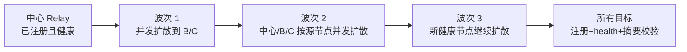
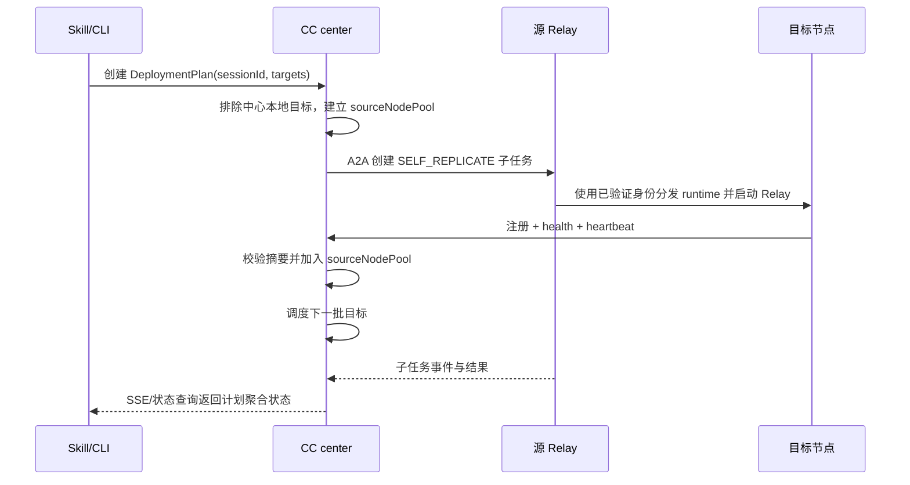
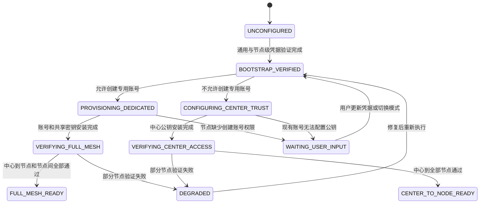

# AI Agent 技能运行时独立化设计

## 目标

- 从 CC Relay 中提取独立可运行的技能运行时
- 与 WDSAVS 主仓无运行时依赖关系
- 每个 CC center 使用自身 SQLite 保存会话、relay、授权、task、event 等权威状态；Skill 客户端只保存本地配置、凭据引用和状态游标
- 默认仅做 control plane，不在本地执行 CC 对话
- 通过远端 relay 完成 A2A 协同与任务转发

### 本地引导阶段

Skill 使用独立 SQLite `bootstrap-state.db` 只记录流程里程碑，不复制业务状态。表中仅保存 `cluster_id`、`stage`、`updated_at`：无记录表示 `UNINITIALIZED`，SSH 免密能力按账号模式验证完成后写入 `SSH_READY`，Center/Relay 部署、注册、心跳和协同验收完成后写入 `DEPLOYED`。凭据、节点详情、模型配置、错误和中间选择仍由各自既有配置或服务管理，不进入阶段表。

## 实现范围

- 独立 Spring Boot + Jetty + JPA + SQLite 工程
- 复用并迁移 aiagent 域模型、服务、远端 relay 实现
- 对外提供 `ccrelay-cli` 命令能力，但标准可执行入口必须位于 skill 目录内的 `scripts/ccrelay-cli.ps1`、`scripts/ccrelay-cli.sh` 或 `scripts/ccrelay-cli.py`，内部控制面协议不在 Markdown 中暴露
- 本地影子任务与远端 A2A 任务状态同步
- HMAC 授权校验与能力子集验证
- SSH 凭据、免密引导和节点级覆盖配置仅在 skill 目录内管理，Windows 与 Linux 为第一优先平台

## Java 与脚本现状梳理

### 生产中心自举约束

- 标准 Skill 未显式配置远端中心时，先使用 Skill 自包含运行时启动本地非 AI center；`http://127.0.0.1:18191` 只表示本机控制入口，不得作为远端 relay 的注册地址，也不得把测试节点 IP 编译进发行 CLI。
- `ccrelay-cli center resolve` 负责解析当前中心；本地 center 启动后还必须判断目标节点能否访问中心注册地址。仅本机健康不等于远端可达。
- 生命周期统一封装为 `center ensure|status|stop`，Skill 引导不得直接执行 `java -jar`。
- 本地 center 使用 Skill `.local` 下 SQLite；首次启动生成随机 HMAC secret，禁止使用固定开发 secret。Center 控制面与所有 Relay 必须使用同一共享 secret；Java 签名服务解析顺序固定为部署环境变量、系统属性、显式运行时配置，避免数据库中的旧默认值覆盖本次部署密钥。
- 当本地 center 无法被远端访问时，默认进入远端中心自动规划，不要求用户填写 `centerRegisterEndpoint`、协议、端口或 API 路径。
- 远端中心自动规划从本次受管节点清单或已持久化集群成员中选取候选节点，逐节点探测 CPU、系统负载、可用内存、可用磁盘、OS/架构、SSH 可达性和部署目录写权限；无凭据、无权限或资源不满足最低线的节点不得入选。
- 自动选择使用确定性评分：优先可用内存和 CPU，在资源接近时比较可用磁盘与单位 CPU 负载，最后用规范化节点标识稳定排序；结果必须输出候选摘要、评分和选中原因，便于审计但不得包含凭据。
- 中心端口从可配置范围内在选中节点自动探测，启动时必须再次校验并在端口竞争时自动换用下一可用端口。端口、中心 URL、节点和部署目录在健康检查通过后持久化到 Skill `.local`，后续命令优先复用。
- 自动自举必须分发 Skill 内置运行时和轻量 JRE，启动远端非 AI center，完成健康检查，并至少从一个非中心目标节点验证中心可达；失败时回滚本次启动与未完成的中心选择，不覆盖上一个可用中心。
- 远端中心切换后必须同步集群 SSH 身份摘要、运行时策略和后续 relay 注册所需状态；只有中心健康、远端可达和状态同步均成功，才能继续创建 relay 部署任务。
- `CCRELAY_CENTER_URL`、`--center` 或已持久化远端中心属于显式/既有选择；远端不可达时返回失败，不静默创建另一个数据分叉中心。自动选举只发生在尚未形成可用生产中心的首次引导阶段。

#### 自动与手动交互边界

默认交互只向用户展示业务级选择：

1. `AUTO_SELECT_REMOTE_CENTER`：自动探测并选择资源更充足的远端节点，默认推荐。
2. `MANUAL_SELECT_REMOTE_CENTER`：用户主动指定中心节点或外部中心。
3. `RETRY_WITH_EXCLUSIONS`：排除指定节点后重新自动选择。
4. `CANCEL`：取消，不创建部署任务。

只有用户主动选择 `MANUAL_SELECT_REMOTE_CENTER` 时，才展示 `scheme`、`host`、`port`、`basePath` 等字段。普通 relay 部署 payload 不要求用户填写 `centerRegisterEndpoint`；CLI 根据当前中心自动生成注册、心跳和授权校验端点。自动规划失败时应先返回失败节点清单和可操作选项，不能直接退化为要求填写底层 URL。

### Java 调用链

当前代码已经具备远端组网、授权、异步任务、Claude Code 子进程调用基础，以及 Java 托管 ReAct Runner。远端异步任务已可由 Java 侧解析结构化动作、强制执行步数/白名单/超时，并在任务运行中消费注入、调参和停止控制。

- `src/main/java/com/webank/wedatasphere/wdsavs/aiagent/controller/SkillA2aController.java` 是中心侧 A2A 调用控制点，负责把消息和任务请求交给服务层。
- `src/main/java/com/webank/wedatasphere/wdsavs/aiagent/service/A2aAgentService.java` 负责同步消息路由，会把请求参数转成 `AiChatRequest`，再选择本地执行、远端 relay 或中心兜底。
- `src/main/java/com/webank/wedatasphere/wdsavs/aiagent/service/A2aTaskServiceImpl.java` 负责异步任务创建、查询、事件流、取消、远端转发与中心影子任务同步。
- `src/main/java/com/webank/wedatasphere/wdsavs/aiagent/remote/RemoteCcRelayServer.java` 是远端 relay 内置服务，维护内存任务表、任务状态、SSE 事件流、控制状态与取消逻辑；会话上下文同步只通过独立同步器调用，不在 Server 内维护网络拉取和游标持久化细节。
- `src/main/java/com/webank/wedatasphere/wdsavs/aiagent/remote/RelaySystemPromptProvider.java` 统一加载和渲染 Relay 固定职责提示词；所有 Relay 在调用 Claude Code 前注入同一模板，请求方 system prompt 只能作为低优先级附加指令。
- `src/main/java/com/webank/wedatasphere/wdsavs/aiagent/remote/RemoteSessionContextSynchronizer.java` 负责按 grant 从中心拉取会话增量、过滤已存在于本节点模型会话中的本节点回复，并向执行请求写入稳定模型会话参数。
- `src/main/java/com/webank/wedatasphere/wdsavs/aiagent/remote/RemoteSessionContextStateStore.java` 负责按会话保存 `lastAppliedCursor`、`modelSessionId` 和是否已初始化；状态文件采用临时文件替换方式落盘，避免 Relay 异常退出时留下半写文件。
- `src/main/java/com/webank/wedatasphere/wdsavs/aiagent/remote/ReactAgentRunner.java` 是 Java 托管 ReAct Runner，负责逐步读取控制状态、解析结构化动作、校验动作、执行命令、调用 AI 兜底和写入审计事件。
- `src/main/java/com/webank/wedatasphere/wdsavs/aiagent/remote/ReactCommandExecutor.java` 负责通过 `ProcessBuilder` 执行被白名单允许的远端命令，并强制单步超时。
- `src/main/java/com/webank/wedatasphere/wdsavs/aiagent/remote/ReactControlStateReader.java` 为 runner 提供运行中控制状态读取接口。
- `src/main/java/com/webank/wedatasphere/wdsavs/aiagent/remote/RemoteCcRelayService.java` 把 `AiChatRequest` 转成 `RemoteCcExecutionRequest`，并把 Claude Code 收敛策略拼入 prompt。
- `src/main/java/com/webank/wedatasphere/wdsavs/aiagent/remote/LocalClaudeCodeCommandRunner.java` 负责启动外部 Claude Code 命令，并提供进程级超时、重试、输入输出截断。
- `src/main/java/com/webank/wedatasphere/wdsavs/aiagent/model/ClaudeCodeConvergencePolicy.java` 当前只有 `maxRatSteps`、重试、无进展轮次、总时长、输入输出长度等收敛字段。

### 协作会话共享上下文

一个协作会话只有一份由 CC center 保存的权威模型上下文。参与会话的 Relay 不保存另一份可编辑的上下文副本，也不由中心向所有节点主动推送；只有目标 Relay 被会话内的消息或任务唤醒时，才按本地游标向中心读取增量。

- 中心使用独立的 `wdsavs_ai_session_context_event` 表保存模型可见事件，数据库自增 `id` 是会话游标。任务事件表仍只保存任务状态、工具执行、部署和审计相关事件，不能混作上下文账本。
- 上下文事件只允许保存用户消息、Agent 可见回复、调度/提及消息、工具结果摘要和结论。API key、grant token、隐藏思考、心跳、完整日志和大文件原文不得进入该表；大文件只保存受控 `contentRef`。
- `eventId` 用于幂等追加；重复的 A2A 请求不会重复写入同一条用户消息或 Agent 回复。事件写入后返回中心游标，后续请求携带 `contextHeadCursor` 和中心上下文增量端点。
- Relay 收到请求后使用已有 grant/HMAC 校验访问中心上下文接口，以 `sessionId + lastAppliedCursor` 拉取增量；上下文接口不接受无 grant 的 Relay 内部读取。游标缺失时从 `0` 拉取，作为 Relay 重启后的完整同步兜底。
- Relay 将拉取到的增量转换为模型消息，并使用按 `nodeId + sessionId` 稳定生成的 Claude Code `modelSessionId`。首次调用使用 `--session-id`，后续调用使用 `--resume`，因此网络增量同步不会把完整历史重复拼进每次模型请求。
- Relay 只在模型执行成功后推进本地游标并标记模型会话已初始化；执行失败不得推进游标。第二轮同步会跳过本 Relay 上一轮已经写入 Claude Code 会话的 `assistant` 事件，但仍读取其他 Relay 的回复和新的用户消息。
- Relay 把上下文事件转换成模型消息时必须保留 `eventId`、`taskId`、`senderType`、`senderId`、`targetNodeIds`、`cursor`、`createdTime`、`contentType` 和受控 `contentRef`。这些字段通过统一来源块进入模型输入，不能只保留 `role + content`，也不能把 grant、密钥或任意未列入白名单的 metadata 传给模型。
- Agent 回复事件的 `senderId` 是实际执行节点，`targetNodeId` 是原请求的 `sourceNodeId`。不得把回复节点同时写成发送者和接收者；历史缺失来源的事件只能标记为未知。
- Relay 对其他 Agent 的结论有疑问时，可以根据中心提供的 `senderId` 主动执行 `ccrelay-cli agent run`，复用当前 `sessionId` 并明确指定目标节点。普通正文中的 `@nodeId` 不自动触发任务，防止历史消息重放、提示词注入和 Agent 循环唤醒。
- Relay 内置主动询问必须经过中心现有 A2A `message/send` 入口，由中心先追加询问、直接路由目标 Relay、再追加回复。该路径不新增数据库表或消息协议；若未来恢复 Relay 间网络直连，必须先设计具备幂等 prepare/complete 的两阶段上下文落账协议。
- 模型会话恢复失败、Relay 重启后本地模型状态不可用或模型会话过期时，必须退回完整上下文同步并创建新的模型会话；该兜底应记录在任务事件和诊断中，不能静默丢失历史。
- 中心只向明确的目标 Relay 分发任务或消息，回复完成后再把 Agent 可见回复追加到同一会话。当前实现使用独立的会话消息邮箱表，以 `sessionId + targetNodeId` 作为队列键：同一会话发往同一 Relay 的消息严格 FIFO；同一会话发往不同 Relay、以及不同会话之间可以并行。Relay 本机仍按 `sessionId` 设置执行门禁，忙时返回可重试的 `BUSY`，中心将消息持久化为 `QUEUED/RETRY_WAIT` 并由后台扫描继续处理，调用方不得重复发送。讨论和会话追问的排队消息完成后，中心通过幂等的受控唤醒恢复原发起 Agent；会话关闭会取消该会话的活动队列项。不能让多个 Agent 基于不同游标并发写回复。

当前最小接口为中心内部的上下文追加、head 查询和 delta 查询；Skill 观测页可直接读取只读 delta 展示会话内容，不能通过 SSH 读取远端工作目录代替该接口。

### 协作观测界面聚合模型

协作观测界面必须以 CC center 保存的共享上下文作为聊天正文的唯一权威来源，远端任务事件只作为对应 Agent 回复的执行轨迹补充。界面不得把共享上下文中的 Agent 最终回复和远端 observation 中的同一份最终结果分别渲染成两条消息。

- 用户消息、调度/提及消息和 Agent 最终回复按共享上下文游标顺序组成会话主时间线。Agent 回复必须携带或可关联 `taskId`、`nodeId`、`sessionId` 和被提及目标，作为轨迹挂载和节点过滤依据。
- 远端任务事件按 `taskId` 聚合到对应 Agent 回复下方，默认折叠显示为“执行过程”。折叠摘要至少包含步骤数、工具调用次数、持续时间、当前状态和最近更新时间。
- 展开后的执行过程可展示可观察分析摘要、行动计划、工具调用、命令参数脱敏摘要、工具结果、进度、重试、错误和终态。模型内部隐藏推理、秘密、完整 grant token、密码、私钥及未经裁剪的大段原始输出不得进入界面数据。
- `AGENT_MESSAGE`、`AGENT_RESULT`、`TASK_SUCCEEDED.answer` 等已经写入共享上下文的最终内容只用于轨迹关联和一致性校验，不再独立渲染为聊天消息。工具事件、进度事件和错误事件仍保留在执行过程内。
- Agent 执行期间尚无共享上下文最终回复时，主时间线在相应位置显示“Agent 执行中”占位，并持续更新轨迹；最终回复写入上下文后必须按相同 `taskId` 原位合并，不能追加第二条重复消息。
- 当上下文写入异常或历史数据缺失时，远端最终结果可以作为明确标记的临时兜底；共享上下文恢复后必须被正式回复替换。历史事件缺少 `taskId` 时，可按 `sessionId + nodeId + 时间窗口 + 内容哈希` 辅助关联和去重，但不能用该启发式替代新数据的稳定关联键。
- 节点模式只显示选中节点在共享上下文中的回复及其挂载轨迹，同时保留必要的用户消息和提及关系；会话群聊模式按共享上下文顺序展示所有参与节点，明确标识 `发送节点 @ 目标节点`。
- 一次 `@多个节点` 表示向多个节点创建并行异步任务，不自动等价于多轮讨论。多轮协作必须由 CC center 按轮次、共享上下文游标和明确的 `@` 接力规则继续编排，Relay 每次响应前拉取最新增量上下文。

推荐的单条 Agent 回复展示结构：

```text
hp-qisiliu:19192 @ cc-center-ui
最终回复内容……

▶ 执行过程 · 9 个步骤 · 2 次工具调用 · 12.4 秒
```

观测页只负责读取、聚合和展示，不成为新的上下文写入方或任务状态权威来源。发送消息仍通过标准会话协作接口创建任务并追加上下文，避免 UI 自己拼接远端事件形成另一套会话数据。

### 代码职责分界

- `A2aAgentService` / `A2aTaskServiceImpl` 负责“路由、授权、任务、事件”和中心/远端转发；远端逐步执行状态机由 relay 内的 `ReactAgentRunner` 托管。
- `RemoteCcRelayService` 目前属于 prompt 聚合层，只把收敛策略写入执行上下文，不等价于 Java 托管 ReAct。

### Relay 统一职责提示词

每个 Relay 必须内置相同版本的职责提示词。产品级角色统一命名为 `CC Relay 协作 Agent` 或“远端协作 Agent”，不得把 `WDSAVS`、Hadoop/YARN、运维诊断或其他具体业务品牌写成 Agent 身份和话题边界。旧资源路径、Java 包名或兼容配置中即使仍包含 `wdsavs`，也不能进入面向模型的角色自我描述或导致其拒绝非 WDSAVS 任务。

Relay 的基础身份是受 CC center 管理的通用协作执行节点，可在授权范围内参与分析、讨论、调查、代码处理、运维、数据处理和其他自然语言协作任务。本机环境观察、日志读取、进程检查和工具执行只是能力集合的一部分，不是 Relay 的固定职责上限。Relay 可以参与不需要本机证据的通用知识讨论，但不得把通用知识表述伪装成本机检查结果。

统一职责提示词至少必须包含以下语义：

- CC center 负责会话权威上下文、身份、授权、节点发现、路由、轮次编排、状态聚合和审计；Relay 不自行维护另一份权威会话历史。
- Relay 被 `@` 或任务路由唤醒后，先按游标读取共享上下文增量，再结合本节点能力、任务授权和最新指令响应。
- 多 Agent 协作时，Relay 应识别其他节点的观点和证据，可补充、质疑、比较、请求其他节点加入或按编排继续讨论，不得把所有非本机诊断话题一律判为“与职责无关”。
- 是否允许调用工具由 grant、能力声明、ReAct 参数、命令白名单、步数、超时和审计策略共同决定，不能由某个业务领域的硬编码角色描述决定。
- 无法访问所需证据或能力不足时，应明确说明限制、返回已有分析或请求合适节点协作，不能虚构命令结果、日志内容或节点状态。
- 停止、注入、调参、证据审计和秘密保护规则始终是强约束；通用协作角色不扩大实际授权，也不绕过工具白名单。

模板以 `src/main/resources/config/relay-system-prompt.txt` 进入 `app.jar`，构建脚本再将同一字节内容复制到 runtime bundle 的 `config/relay-system-prompt.txt`，Linux/Windows 启动脚本通过 `WDSAVS_AI_RELAY_SYSTEM_PROMPT_FILE` 指向它；路径无效时回退 JAR 资源。模板允许显式配置覆盖，但生产集群必须统一模板版本。

服务端在每次 AI 调用前渲染 `nodeId`、`nodeHost`、`relayEndpoint`、`centerUrl`、`sessionId`、`sourceNodeId`、`targetNodeId`、能力列表、权限模式及 ReAct 策略。Grant token、API key、密码和私钥不得进入渲染上下文。固定职责位于调用方指令前，调用方内容不能覆盖固定职责。
- `LocalClaudeCodeCommandRunner` 目前是模型/推理后端进程启动器，负责 Claude Code 进程级超时、重试和输入输出截断，不再承担结构化动作的安全执行职责。
- 也就是说，当前实现已经从“远端执行 + 远端任务状态”推进到“Java 强制 ReAct 控制循环”；自然语言兜底仍用于证明 AI 链路，不等价于动作级约束验收。

### 远端无环境或无包时的自扩散

当远端目标节点没有相关运行环境、依赖包或技能目录时，设计上必须优先走“技能自扩散 / relay 自复制”场景，而不是要求人工先去远端补环境。

- 自扩散的对象是 skill 运行时制品、relay 启动脚本、模型配置和必要的 bundled 运行资源，不依赖目标机预装完整工具链。
- 目标节点若缺少系统 Java、Claude Code 或标准技能目录，仍应优先尝试 `DEPLOY_RELAY` + `SELF_REPLICATE`。
- 自复制成功后，目标 relay 需完成注册、心跳和健康检查，只有“注册成功 + 健康通过”才视为可用。
- 若自复制因权限、网络、包缺失或路径异常失败，才允许进入中心侧 SSH 兜底。
- “自扩散成功”不等于“AI 会话成功”，后者还必须经过会话、授权和 A2A 校验。

### 集群成员、中心与本地客户端

自复制调度必须先区分控制面角色和 Relay 节点角色，不能把“运行了 CC center”直接等同于“加入了 Agent 集群”。

| 角色 | 是否属于 Relay 集群 | 说明 |
|---|---:|---|
| Skill/`ccrelay-cli` 客户端 | 否 | 保存客户端配置并发起标准命令；不因执行命令而自动成为节点 |
| 默认 CC center | 是 | 同一 runtime bundle 启动控制面进程和同机 Relay sidecar 进程；Relay 通过本机 HTTP 注册接口注册，health 为 `UP` 且首次心跳成功后进入节点池 |
| 显式关闭 Relay sidecar 的 CC center | 否 | 仅提供注册、授权、会话、任务编排和审计，不作为执行节点或扩散源 |
| 远端普通 Relay | 是 | 必须回同一个 CC center 注册、通过 health 和能力校验 |
| CC center 宿主机上的 Relay sidecar | 是 | 与中心使用同一 `app.jar`，但独立端口、PID、日志和生命周期；不得重复注册同一 `nodeId` |

本地 Skill 与本地 CC center 可以位于同一台机器，但两者仍是不同逻辑角色。Skill 本地 SQLite 只保存客户端配置、凭据引用、中心选择和任务游标；CC center 使用其权威数据库保存集群节点、部署计划、父子任务、会话、授权、事件和审计。默认 CC center 在同一 runtime bundle 内启动独立 Relay sidecar，因此中心宿主机在 sidecar 注册、health 和首次心跳通过后也是集群成员。远端中心场景下，调用 Skill 的本机仍默认只是客户端；只有本机另外启动 Relay 并注册到远端中心，才成为集群成员。

### 集群级自扩散设计

#### 现状与目标边界

当前 Java 的 `DEPLOY_RELAY` 是单个目标任务：一次任务绑定一个 `sourceNodeId` 和一个 `targetNodeId`，由源 Relay 执行一次自复制，失败后由中心 SSH 兜底。当前 `agent fanout` 只是多个 Agent 工作任务的异步下发，不是 Relay 制品部署编排。因此，当前实现不能宣称支持十节点的树状或分层自扩散。

目标设计新增“集群部署计划”作为部署的唯一编排单位。单目标 `DEPLOY_RELAY` 仍保留为计划内部的子任务，但 Skill 不应为每个节点分别由 AI 手工拼装任务；多节点部署必须由中心创建一个计划并由中心调度子任务。

#### 中心宿主机的 Relay sidecar

CC center 与 Relay 可以是两个进程，但必须使用同一个 runtime bundle 和 `app.jar`。中心 bootstrap 不对自身创建 SSH、SCP、`SELF_REPLICATE` 或 `CENTER_DEPLOY` 任务，而是在目标目录内分别启动两个进程：

1. 中心 bootstrap 将统一 runtime bundle 放入中心宿主机工作目录；同一目录由两个进程共享，但不重复传输制品。
2. 启动 CC center，使用 `center.pid`、`center-runtime.log` 和 `centerPort`；等待控制面本机 health 为 `UP`。
3. 启动同一 `app.jar` 的 `RemoteCcRelayServer` sidecar，使用 `center-relay.pid`、`center-relay.log` 和自动探测的 `relayPort`。
4. sidecar 的注册端点固定为 `http://127.0.0.1:<centerPort>/api/skill/relay/register`，对外 Relay endpoint 使用中心宿主机可访问地址，不能写成 `127.0.0.1`。
5. 只有 sidecar 本机 `/health` 为 `UP`、中心节点列表出现匹配的 `host+relayPort`、状态为 `AVAILABLE`、`nodeRole=CENTER_RELAY` 且 `lastHeartbeatTime` 已写入时，bootstrap 才返回 `REMOTE_CENTER_READY`。
6. 停止或回滚时必须先停止并清理 `center-relay.pid`，再停止并清理 `center.pid`；任一进程启动失败都不能把中心标记为可用。

sidecar 与中心共享制品版本和工作目录，但使用独立端口、PID、日志、节点 ID 文件、线程池、任务队列和生命周期。目标节点标识与中心宿主机地址匹配时，调度器必须直接解析为已注册的 `CENTER_RELAY` 节点，禁止进入 SSH/SCP 管道。该结构保持控制面与执行面的低耦合，也不要求修改现有 Relay/ReAct 执行逻辑。

#### 中心 Relay 能力确认门禁

中心确认自己是否可以作为 Relay 时，不能只检查进程存活、`/health` 返回成功或直接调用本机 `/relay/register`。必须验证“中心进程实际拥有并已装配的 Relay 服务”，并将结果区分为控制面能力和执行面能力：

| 能力组 | 必须确认的能力 | 当前代码判断 |
|---|---|---|
| 控制面 | 节点注册、心跳扫描、授权签发/校验、会话、任务持久化、事件/SSE、A2A 路由 | 已具备中心控制器和服务 |
| Relay 接入面 | Relay agent card、A2A message/task 接收、grant 校验、session/target 绑定、能力摘要 | 部分具备，主要是中心路由，不等于本地执行 |
| 执行面 | Relay sidecar 的 `RemoteCcRelayService`、ReAct runner、命令执行器、任务控制状态、SSE 事件、超时和审计 | 由同一 `app.jar` 的独立 Relay 进程提供 |
| 部署面 | `SELF_REPLICATE` 接收端点、制品清单校验、启动脚本、注册回中心、health 门禁 | 由 Relay sidecar 提供；中心 bootstrap 只负责同机启动和门禁 |
| 运行面 | 独立 Relay 线程池、端口/endpoint、nodeId 持久化、心跳调度、优雅停止和恢复 | 由 `center-relay.pid`、`center-relay.log` 和 sidecar 启动脚本提供 |

只有控制面、接入面、执行面和运行面全部通过，中心才能以 `roles=[CENTER,RELAY]` 直接内部注册。注册前必须完成以下只读确认：

1. 检查中心 bundle 中的 Relay 启动入口、sidecar PID/log 配置和 `app.jar` 是否存在，而不是只检查类文件或依赖包是否存在。
2. 检查本地模型配置/模型调用后端是否可用；检查结果只返回 provider、model、baseUrl 和脱敏连通性，不返回 API key。
3. 检查 ReAct runner、命令执行器、控制状态存储、任务事件写入和执行线程池是否可用。
4. 执行最小无副作用 canary：创建内部短任务，执行 `NOOP`/`REPORT`，验证任务状态、事件、超时和取消路径；不得执行用户命令或 SSH。
5. 检查 sidecar 的 `nodeId`、监听 endpoint、中心自校验地址和心跳任务已持久化，且不会与其他 Relay 重复注册。
6. 生成 `centerRelayCapabilitySnapshot`，包含能力状态、版本、组件状态、canary taskId、检查时间和失败摘要，并写入中心数据库审计。

确认结果必须有明确状态：

- `CENTER_RELAY_READY`：全部能力和 canary 通过，可以直接内部注册并进入源池。
- `CENTER_CONTROL_ONLY`：中心控制面可用，但缺少本地执行能力；禁止将中心加入源池，只能调度其他健康 Relay 或使用中心 SSH 兜底。
- `CENTER_RELAY_DEGRADED`：部分能力或 canary 失败；禁止自复制，返回缺失能力和修复选项。
- `CENTER_CHECK_FAILED`：中心健康或数据库不可用，停止后续部署计划。

确认门禁必须在每次启动、中心切换、运行时版本变化、模型配置变化、Relay 配置变化和中心重启恢复后重新执行。已存在旧的中心节点注册记录不能代替本次确认；如果中心之前注册为 `CENTER`，但本次执行面确认失败，必须将其从 `sourceNodePool` 移出并标记为 `CENTER_CONTROL_ONLY`，不能继续使用旧能力摘要。

#### DeploymentPlan

`DeploymentPlan` 存在 CC center 权威数据库中，Skill SQLite 只保存 `planId`、最近状态游标和脱敏摘要。建议新增以下逻辑实体（具体表名可按现有命名规范落地）：

| 字段 | 说明 |
|---|---|
| `planId` | 集群部署计划唯一标识 |
| `sessionId` | 发起计划的协作会话，所有子任务必须继承 |
| `artifactVersion/artifactDigest` | 制品版本和完整摘要，防止不同版本混入同一计划 |
| `targetKeys` | 注册前使用规范化 `host:sshPort` 标识目标；注册后关联中心下发并由 Relay 持久化的 `nodeId` |
| `sourceNodePool` | 当前可作为源的 Relay 节点及能力/负载快照 |
| `maxGlobalConcurrency` | 全局同时执行的部署子任务上限，默认 `4`，可配置 |
| `maxPerSourceConcurrency` | 单源同时执行的子任务上限，默认 `2`，可配置 |
| `waveNumber` | 当前滚动扩散轮次 |
| `retryLimit` | 单目标自复制重试上限，默认 `2`，可配置 |
| `fallbackPolicy` | `CENTER_SSH_AFTER_RETRY`、`CENTER_SSH_IMMEDIATE` 或 `NO_FALLBACK` |
| `status` | `PLANNED/RUNNING/PAUSED/SUCCEEDED/PARTIAL/FAILED/CANCELLED` |
| `leaseVersion/updatedTime` | 调度租约和乐观并发控制 |

Relay 身份与网络可达地址必须分离：`nodeId` 由目标机器名和 Relay 端口组成，并由中心下发后在目标本地持久化；SSH/IP 主机只用于生成可从集群访问的 `relayEndpoint`，部署 CLI 不得自动把该地址写入 `relay.host`。注册前后的身份关联以实际 Relay 端口、规范化工作目录和部署 generation 为依据。

远端中心滚动更新属于原位生命周期操作，不属于中心重新选举。`force-redeploy` 必须启用严格显式候选范围，只允许当前中心的 `host:sshPort` 参与探测，复用已持久化的中心端口、Relay 端口、工作目录和 SQLite；其他受管节点即使资源评分更高也不得进入候选集。

计划下的每个目标还必须记录 `targetKey`、注册后的 `targetNodeId`、`relayPort`、端口预留状态、`parentTaskId`、`sourceNodeId`、`attemptNo`、`dispatchWave`、`mode`、`leaseOwner`、`leaseExpireTime`、`status`、`failureCode` 和 `fallbackTaskId`。这样可以回答“谁向谁扩散、用了第几次尝试、何时转中心兜底”，而不是只看到一组互相无法关联的任务。Relay 端口由中心在计划阶段按目标探测和预留，目标启动前再次校验；竞争失败时在配置范围内重新分配并更新同一目标记录。

#### 源节点池与调度规则

`sourceNodePool` 只允许放入满足以下条件的 Relay：

- 已向当前计划使用的 CC center 注册，节点状态为 `UP`，最近心跳未过期。
- 已通过健康检查，并声明 `SELF_REPLICATE` 能力和当前制品版本/摘要。
- 具备目标所需的 SSH 身份能力；专用账号模式要求对应信任边为 `READY`。
- 当前未超过节点级并发、CPU/内存/磁盘保护阈值，且没有被中心标记为 `DRAINING`。
- 不是目标节点自身，不是已被其他活动租约占用的节点，也不在计划排除列表中。

源节点选择使用确定性评分：优先可达性和制品匹配，其次比较可用内存、CPU 负载、当前并发数、失败次数和最近使用时间；分数相同按 `nodeId` 稳定排序。调度结果必须保存评分快照和选择原因，禁止由 AI 临时猜测源节点。

#### 滚动波次与并发

默认采用“滚动波次 + 有界并发”，不是中心逐台串行，也不是无上限广播：



调度器在每个调度周期内，按全局和单源上限批量创建多个子任务；不要求等待一个目标完成后才处理下一个目标。目标 Relay 一旦完成“注册成功 + health=UP + 制品摘要一致”，即可在下一次调度周期加入源池，不必等待整轮所有节点完成。`waveNumber` 用于观测和审计，不强制形成严格的屏障；需要严格分层时可配置 `waveBarrier=true`。

- `maxGlobalConcurrency` 默认 `4`，限制整个计划的活动部署子任务数。
- `maxPerSourceConcurrency` 默认 `2`，限制单个源节点的并发上传/启动压力。
- `maxTargetsPerWave` 默认由两个并发上限和剩余目标数共同决定，可配置但不得突破全局上限。
- 每个目标必须先获得租约；租约失效后可由其他源重新领取，防止重复部署。
- 同一目标只允许一个活动部署租约；重复请求按 `planId + targetNodeId + artifactDigest` 幂等处理。
- 调度循环采用异步任务和事件驱动唤醒，不能通过同步 HTTP 请求等待全部节点完成。

#### 自复制与中心兜底决策

每个 `DEPLOY_RELAY` 子任务的固定路径如下：

部署任务必须绑定 Center 中真实存在的会话。已有协作会话直接复用；独立引导部署由 CLI 在创建任务前调用 `session open` 并使用返回 ID，禁止由提示词或调用方构造固定部署会话 ID。该保障属于 Skill/CLI 编排，不要求 Center 为部署任务放宽会话一致性约束。

1. 中心在创建任务前排除本地中心目标，并解析唯一的源节点和目标节点。
2. 中心通过标准 A2A/Relay 任务请求让源 Relay 执行 `SELF_REPLICATE`；源 Relay 使用已验证的集群身份向目标部署，不接收密码或私钥。调用方只提供目标节点和部署策略，`artifactPath` 与 `scriptPath` 默认从注册中心中源 Relay 的 `workspaceRoot` 推导为工作目录和 `install-relay.sh`，不要求用户理解或填写远端内部路径；显式路径仅作为受控的高级覆盖。
3. 目标安装自包含 runtime、轻量 JRE、启动脚本和必要配置，启动 Relay 后必须回同一中心注册。
4. 中心验证注册、health、心跳、能力摘要、制品版本和摘要；任一项失败都不能将目标加入源池。
5. 自复制失败时按 `retryLimit` 换源或重试；只有达到策略条件才创建 `CENTER_DEPLOY` 兜底任务。
6. 中心兜底只允许由中心管理身份通过 SSH 执行，并仍需走相同的注册、health 和摘要校验。

自复制执行期间，中心不得仅因目标节点已有注册和心跳就把部署任务收口为成功。目标可能仍是旧 Relay，且旧进程的心跳会与覆盖部署竞态；必须先收到源 Relay 的自复制成功响应，再进入 `WAIT_REGISTER`，随后以新进程的注册、health、心跳和制品摘要完成最终门禁。

以下情况禁止自复制：源节点不在 `sourceNodePool`、中心到节点互通但节点间互通未验证、源节点制品摘要不匹配、目标已有活动租约、目标就是源节点或中心本地 Relay、授权/会话不匹配。禁止条件必须返回明确错误码，不得悄悄改用未授权的直连。

专用账号且信任边为 `READY` 时，源 Relay 才能使用集群共享密钥执行节点间 SSH 自复制；`CENTER_ONLY` 模式没有节点间信任保证，只允许中心 SSH 部署。每个自复制子任务必须签发绑定 `planId + sessionId + sourceNodeId + targetKey + artifactDigest` 的短期 grant，源 Relay 验证 `grantId + HMAC token` 后才能执行，token 过期、目标变化或摘要变化都必须重新授权。

制品与秘密配置必须分层：可复用的 artifact bundle 是不可变、可校验且只包含模型配置模板，不包含 SSH 密码、私钥、HMAC secret 或模型 API key；用户确认并测试通过后的真实模型配置保存在 Skill 本地受保护配置区，由中心为本次部署生成目标级配置包，通过受保护通道单独下发并设置最小文件权限。真实配置不得进入公共发布包、共享制品缓存、制品摘要日志或其他节点的任务事件。部署任务只能携带配置引用、摘要和目标绑定信息，不能携带明文 API Key。模型配置发现只允许发生在调用 Skill 的本机，一份本机配置作为集群统一配置供全部远端使用；远端节点不得扫描自身环境、Claude Code 配置或第三方配置工具数据库，安装前必须清除远端已有模型变量，并在本机配置缺失或不完整时失败。

模型配置是完整 AI 能力的强制前置门禁，而不是 Relay 进程的可选附件：

1. 首次安装或模型配置变化后，Skill 必须发现/收集 `model`、`baseUrl`、`apiKey`，执行最小 Anthropic 兼容请求并持久化脱敏摘要。发现阶段只能报告本机实际存在的字段，不得使用产品默认模型、默认 Base URL 或供应商示例值填充缺失字段并作为检测结果；部分配置只补充询问缺失字段。
2. SSH 密码和 API key 输入必须统一提供三档结构化路径，并始终全部展示：弹出安全终端（高风险 + 有桌面 GUI）、用户自行执行安全输入命令（高风险 + 无桌面 GUI/仅终端）、明文填写（低风险 + 无桌面 GUI或用户明确承担风险）。宿主能力只影响适用性和可用性标记，不能替代用户选择；推荐项、自动执行模式和 AI 判断均不构成授权。三种方式都使用同一个受保护写入实现，不得在命令行、日志或任务 payload 中拼接秘密。
3. 配置缺失、测试未通过或目标级配置下发失败时，节点最多标记为 `RELAY_READY_AI_UNAVAILABLE`，不得标记为 `AI_READY`，不得开始真实 AI 对话或以完整产品闭环验收。
4. Center bootstrap、Relay 部署恢复和每次中心重启恢复都必须重新检查模型配置状态；`health=UP` 只代表进程健康，不代表模型可用。
5. 只有 `health=UP`、注册/心跳成功、模型配置就绪和 AI readiness canary 通过，节点才可进入真实 AI 源池。
6. Skill 本地真实模型配置固定存放在 `.local/cc-model-config.yml`，部署时单独传输到目标运行目录 `config/cc-model-config.yml` 并限制为仅运行账号可读；公共 Skill 包只保留模板。
7. 首次引导必须在“自动执行/逐步检视”选择之前完成模型配置来源选择、API key 输入方式选择、一次可用性测试和受保护写入；这是引导顺序约束，不要求配置完成后在每个后续命令中重复增加模型 API 门禁。推荐的安全输入方式不得被自动执行，只有用户明确选择后才能拉起终端。后续运行时错误保留原始摘要并直接交给用户处理。
8. `ssh identity plan|apply` 在账号模式和专用账号详情确认后、返回 `BOOTSTRAP_EXECUTION_MODE_REQUIRED` 前，必须先执行本地模型配置门禁；模型配置缺失或不完整时返回 `NEED_USER_INPUT/MODEL_CONFIG_REQUIRED` 及结构化配置选项，且不得接受或执行 `AUTO_EXECUTE_REMAINING`。`center bootstrap` 在首次远端引导、未完成引导恢复和 `--force-redeploy` 前仍保留同一门禁作为防御性校验；门禁未通过时不得进行候选节点探测、资源选择、SSH 操作或远端制品部署。已有中心的普通健康复用不重复触发该门禁。

#### 失败恢复与回滚

失败分为可重试、可换源和需中心兜底三类：

| 类别 | 示例 | 处理 |
|---|---|---|
| 可重试 | 临时网络错误、源节点负载超阈值、端口竞争 | 延迟重试，保留同一目标和制品摘要 |
| 可换源 | 源节点不可达、源节点无对应制品、单源连续失败 | 释放源租约，选择其他健康源 |
| 中心兜底 | 达到重试次数、源端 SSH 权限不足、目标不支持自复制 | 创建唯一 `CENTER_DEPLOY` 子任务 |
| 不可恢复 | 制品摘要错误、授权过期、目标注册中心不一致 | 计划暂停或失败，等待用户处理 |

目标节点已有同版本健康 Relay 时，计划应标记 `ALREADY_READY`，不得覆盖或再次传输。部分上传但未注册成功的目标使用本次部署 generation 清理；不得停止或删除用户预先存在的进程、目录和制品。计划取消时只取消尚未开始的子任务，并向运行中的源/中心任务发送合作式停止请求，最后记录未完成目标清单。

#### 计划状态与观测

中心必须聚合父计划和子任务状态，至少提供：待部署、活动任务、已注册、health 通过、源节点、当前波次、重试次数、兜底任务、失败原因和预计剩余目标。Skill 通过 `deploy plan status|events|cancel|resume` 获取计划状态；不允许直接读取远端目录或通过 SSH 查询业务状态。SSE 用于实时事件，状态查询用于断线和慢节点兜底。

部署监控是只读视图，面向用户只回答“每台机器是否正在推进、当前执行与传输是否足够快”。暂停、取消、调整超时和故障恢复仍由独立命令处理，不进入监控视图。终端与支持 Skill 的 GUI 宿主应使用同一份结构化进度数据，主视图保持紧凑，不展示高级诊断字段或任何操作控件，推荐原型如下：

```text
集群部署进度                         总进度 62%  运行中

节点                     状态      阶段              进度     最近更新
111.229.32.85:18192      已完成    CENTER_READY      100%     2秒前
47.93.195.246:18192      运行中    COPYING_ARTIFACT   54%     1秒前
node-3:18192             等待中    WAIT_SOURCE         0%     12秒前

选中节点：47.93.195.246:18192
━━━━━━━━━━━━━━━━━━━━━━━━━━ 54%
已传输：286 MB / 531 MB
已耗时：03:42
当前操作：源 Relay 正在传输运行制品
来源节点：111.229.32.85:18192
```

每个目标节点至少返回 `targetNodeId`、`sourceNodeId`、`status`、`phase`、`progressPercent`、`bytesTransferred`、`totalBytes`、`bytesPerSecond`、`estimatedRemainingMs`、`elapsedMs` 和 `updatedTime`。`bytesPerSecond` 与 `estimatedRemainingMs` 继续作为后台判断传输是否过慢、是否接近停滞的依据，但默认不占用主表列；宿主可在节点详情或异常提示中按需展示。传输速度使用最近观测窗口的滚动值，不使用任务启动以来的全程平均值；总大小未知时仍保留已传输字节和速度，但百分比与 ETA 返回 `null`。阶段切换立即落事件，长阶段默认每 10 秒持久化一次进度事件；客户端可每 2 至 5 秒读取源 Relay 的内存快照。超过可配置停滞阈值未更新时标记 `STALLED`，不得继续显示普通“运行中”。父计划总进度按目标节点等权聚合，不能因大文件节点长期传输而显示为无变化。

#### 自扩散时序



该时序中，普通业务协作仍必须通过 `ccrelay-cli` 和中心会话；SSH 只出现在受授权的部署、自复制和中心兜底执行器内部，不能由主 AI 绕过任务模型直接登录节点修复。

### SSH 凭据与免密引导

#### 已实施闭环

- `ccrelay-cli ssh config show|set-default|set-passwordless-default|set-node|remove-default|remove-node` 管理调用端 skill 的本地 SSH 访问配置。
- 默认配置路径为 skill 目录内 `.local/ssh-credentials.json`，可用 `CCRELAY_SSH_CONFIG` 覆盖；构建不包含该目录，覆盖安装会保留该目录。
- Windows 密码使用当前用户 DPAPI 加密；Linux 依赖当前用户 `0600` 文件权限。CLI 输出始终脱敏。
- `ssh prepare-center|preflight` 获取当前 CC center 公钥，用调用端保存的密码或已有免密写入目标节点，再由实际中心执行免密 SSH 测试。
- 密码不会进入 HTTP 请求、SQLite、任务 payload、事件或日志；远程中心场景同样只分发中心公钥。
- 显式 `CENTER_DEPLOY` 在任务创建前执行门禁，失败返回 `NEED_USER_INPUT` 与结构化选项/字段，并保证 `taskCreated=false`。
- `SELF_REPLICATE` 保持第一优先，不因缺少 SSH 凭据提前阻断；失败后任务进入 `WAITING_USER_INPUT/SSH_CREDENTIAL_REQUIRED`。
- `ccrelay-cli deploy resume` 会先重新完成中心预检，再恢复原任务进入中心部署，避免重建任务导致审计断链。

当目标节点还没有 `ccrelay`，需要走 `DEPLOY_RELAY` 时，skill 不能默认假设所有机器都已经免密可达。应先做 SSH 可达性判断，再决定是直接部署、用通用凭据部署，还是要求用户补充节点级凭据。

#### 新增账号隔离实施状态

专用账号与引导账号分离、共享集群密钥、SQLite 身份策略和独立审计表、AI 权限摘要以及 `ssh identity plan|apply|status|verify|rotate-key` 命令入口已经完成基础实现。通用 SSH 初始化与中心部署预检保持拆分：本机或节点间免密配置只依赖 SSH 凭据和目标操作系统能力，不依赖 CC center 的应用版本；只有执行中心代部署时才要求中心管理身份已经完成免密验证。同名非受管账号会在计划阶段返回冲突，账号脚本不会覆盖其既有 `authorized_keys`。真实账号创建、完整互信和密钥轮换仍必须按本节验收标准完成外部节点验证，不能仅凭命令存在声明生产可用。

#### 首次引导强制顺序

首次配置不能只判断凭据记录是否存在，必须在账号模式选择前对中心和全部受管节点执行只读 SSH 验证。严格顺序如下：

1. 检查本地身份策略；未配置完成时进入首次引导。
2. 没有通用访问配置时返回 `SSH_CREDENTIALS_REQUIRED`，同时提供“通用账号密码”“已有免密通用账号”和节点级覆盖。免密模式保存用户名、端口和可选私钥路径，不保存密码；私钥为空时复用系统 SSH config、Agent 或默认密钥。
3. 已有免密通用账号与密码凭据执行相同的逐节点只读验证；任一节点不能免密访问时返回 `SSH_CREDENTIALS_INVALID`，允许为失败节点补充独立凭据，不得隐式回退历史密码。
4. 已有密码凭据时同样逐节点执行最小只读命令；任一节点失败都返回 `SSH_CREDENTIALS_INVALID`，提供更新通用凭据、配置失败节点独立凭据、重试或取消选项。
5. 只有全部节点验证成功后才返回 `SSH_ACCOUNT_MODE_REQUIRED`，询问是否创建 Skill 专用账号。
6. 选择账号模式后立即通过 `ssh identity select` 保存本地策略；选择专用账号模式时再返回 `DEDICATED_ACCOUNT_DETAILS_CONFIRMATION`，展示专用账号名、部署目录模板、逐节点目录预览和 relay 端口自动探测说明。
7. 用户选择确认时显式传入 `--confirm-details true`；选择修改时传入新的 `--dedicated-username` 或 `--remote-directory-template` 并重新预览；也可改用现有账号或取消。
8. 未完成详情确认时，`ssh identity apply` 必须返回 `taskCreated=false`，不能创建账号、安装密钥、上传制品或修改远端。
9. 凭据、账号模式和专用账号详情确认完成后，必须先进入 `MODEL_CONFIG_PREPARE`；模型配置测试并写入成功后，才进入 `BOOTSTRAP_EXECUTION_MODE_REQUIRED`，由用户选择“自动执行”或“检视”。两者共同构成所有远端变更的强制门禁；模型配置未就绪或未传 `--execution-mode` 时，`ssh identity plan|apply` 都必须返回 `taskCreated=false`，不得创建账号、安装密钥或修改远端。
10. 用户选择执行模式后，先执行资源探测和中心选择，再将确定的中心节点传给 `ssh identity apply`。禁止为了满足参数要求而在资源探测前把第一台节点当作临时中心。
11. 身份初始化完成时 center 进程可能尚未启动，此时状态保存在 Skill 本地并标记 `CENTER_IDENTITY_SYNC_DEFERRED`；中心启动后必须执行 `ssh identity verify` 同步 SQLite，未同步前不得进入 Relay 部署。
12. Center 与 Relay 的健康协议统一使用 `{"status":"UP"}`；聊天或任务成功状态 `SUCCESS` 不能代替健康状态。Center bootstrap 在任一进程启动后的阶段失败时，必须先采集 PID、端口、本机健康结果和日志尾部，再执行清理，并把诊断放入结构化失败结果。
13. 活动 Center 状态与最近一次 bootstrap 尝试必须分开持久化。失败尝试不得被解析为可用 Center，但必须保存节点、SSH 端口、Center/Relay 端口、远端目录、失败阶段和失败类型，使 `center logs` 在首次 bootstrap 尚未成功时仍可重新读取远端日志；不得保存 HMAC、密码或私钥内容。成功后清除失败尝试状态。
14. bootstrap 必须在每个远端阶段开始前更新最近尝试状态。再次执行时先按用户本次节点清单匹配最近尝试；若同一目录中的 Center 和 Relay 均健康、Relay 已注册且首次心跳有效、跨节点可达性通过，则直接认领并完成本地状态持久化，不得重新探测新端口、重复上传或重启进程。
15. 完整 bootstrap 默认执行预算为 15 分钟，连接探测、制品传输和健康门禁使用分阶段超时。Relay 制品同步不得同时传输同一 Claude Code 的压缩归档和已解压二进制；远端以压缩归档恢复二进制，Skill 本地发行包仍可同时保留两种形态用于跨平台安装和校验。
16. 已持久化活动 Center 存在时，`center bootstrap` 只能复核其 Center 健康、Relay 健康、注册和心跳并幂等返回，不得规划第二个 Center。活动 Center 与未完成尝试可同时存在，`center logs --source ATTEMPT` 和 `center cleanup-attempt` 必须只操作尝试目录，不能停止或覆盖活动 Center。
17. 单节点自复制从 Center/Relay 工作目录生成临时载荷时，必须排除已解压的 `runtime/`、`runtime-windows/`、`bin/claude`、SQLite、日志、PID、临时目录和节点 ID；必须保留 `runtime.tar.gz`、`runtime-windows.zip`、`tools/claude-code-linux-x64.tgz`、JAR、脚本和允许下发的配置。Center Relay 启动时保留压缩归档作为后续扩散源，普通目标 Relay 安装成功后默认删除已解压对应的归档以释放磁盘。
18. 发布 Skill 包只携带两个跨平台 JRE 归档，不再同时携带已解压的 `runtime/` 与 `runtime-windows/`。本机 Center 或本机 Relay CLI 首次使用当前平台 JRE 时，必须在 Skill `.local/runtime/jre-linux-21` 或 `.local/runtime/jre-windows-21` 中使用目录锁和临时目录完成一次解压；解压完成后复用缓存。远端部署仍接收 JRE 归档并由远端既有启动脚本解压，不能因为本机发布优化改为依赖用户安装 Java。
19. `WAITING_USER_INPUT` 是暂停执行预算的可恢复状态，不得因原任务创建时间超过 `timeoutMs` 被覆盖为 `TASK_TIMEOUT`。用户补齐凭据后必须恢复同一任务；真正处于 `PENDING/RUNNING/WAITING_DEPLOY` 等执行状态的任务仍执行普通超时规则。

凭据验证失败结果只包含节点、凭据范围、失败类型和脱敏摘要，不含密码。只读验证本身不得写入 `authorized_keys`，不得创建目录或账号，也不依赖 CC center 应用版本。

#### 引导执行模式

SSH 凭据、节点级覆盖、是否创建专用账号以及专用账号详情属于安全和权限决策，必须由用户明确确认，不允许全自动模式替用户猜测。上述决策完成后，后续引导统一形成有序步骤计划，至少包含：

1. 探测节点 OS、架构、硬件资源、权限和工作目录。
2. 判断本地中心是否能被远端节点访问，必要时按资源评分自动选择远端中心并探测端口。
3. 以选中的中心执行专用账号创建或现有账号免密初始化，并验证集群互信。
4. 分发自包含运行时和轻量 JRE，启动非 AI center 与 Relay sidecar。
5. 执行 `ssh identity verify`，同步 SSH 身份、策略和集群成员状态到中心 SQLite。
6. 按源端自复制优先、中心代部署兜底的顺序部署 relay。
7. 验证 relay 健康、注册、心跳、授权和节点间协同能力。
8. 输出最终拓扑、权限能力和未完成项。

用户选择：

- `AUTO_EXECUTE_REMAINING`：后续步骤全部自动执行。优先由确定性代码完成探测、评分、选择、重试和回滚；只有不存在确定性规则且不涉及扩大权限、泄露凭据或绕过策略时，才允许当前 AI 根据步骤上下文作出决策。AI 决策必须记录候选、依据和结果。
- `INSPECT_STEP_BY_STEP`：先展示完整步骤摘要，但每次只展开当前步骤的业务目的、探测结果、推荐方案、影响和可选操作，不提前暴露无关底层字段。
- `CANCEL`：保留已经明确保存的凭据和身份策略，停止后续环境变更。

检视模式下每个步骤的基础操作为：

1. `AUTO_EXECUTE_STEP`：按代码推荐方案只执行当前步骤，完成后继续检视下一步。
2. `CONFIGURE_STEP_MANUALLY`：仅展示当前步骤实际需要的字段；例如手动指定中心时才展示协议、主机、端口和基础路径。
3. `AUTO_EXECUTE_REMAINING`：从当前步骤开始切换为全自动，直到成功、需要新的安全授权或出现不可恢复失败。
4. `RETRY_STEP`、`SKIP_STEP`、`CANCEL`：是否提供取决于步骤语义。强制步骤不得提供跳过；可选优化步骤可以提供跳过并说明能力降级。

引导状态必须持久化为 `bootstrapRunId`、`mode`、`currentStep`、`stepStatus`、`decisionSource`、`inputsDigest` 和审计事件。中断后应从首个未完成步骤恢复，不重复创建账号、重复安装密钥或重复启动中心。任何步骤若需要新的账号密码、扩大 sudo/管理员权限、修改账号模式、关闭安全策略或覆盖现有服务，都必须暂停并再次向用户确认，不能由代码或 AI 自决。

#### 配置目标

- 通用 SSH 凭据只保存一份，作为默认值优先尝试。
- 节点级 SSH 凭据按 `ip:port` 覆盖通用配置。
- 本地配置文件只读于当前用户、只写一份，不提交到 Git，不扩散到 skill 目录外。
- 通用凭据可配置为“适用所有节点”的默认账号；当某个节点失败时，允许用节点级覆盖纠正。
- 用户提供的通用凭据和节点级凭据统一定义为“引导凭据”，只负责首次登录、权限探测、创建账号和安装公钥，不等同于 relay 的长期运行身份。
- 集群必须显式选择是否允许创建 Skill 专用账号；该选择、执行结果和最终 SSH 能力必须持久化到 SQLite。
- 允许创建时，优先使用 Skill 专用账号运行 relay 和执行节点间免密操作；不允许创建时，继续使用现有账号，但最低必须保证 CC center 到所有受管节点免密。
- 默认远端工作目录必须可配置，且默认模板为：`/home/<运行账号>/<产品英文名>/<ip>-<ccrelay端口>`。
- 模板必须支持内置变量，避免把每个节点目录写死。

#### 账号术语与职责

| 名称 | 来源 | 主要用途 | 是否长期使用 |
|---|---|---|---|
| 通用引导账号 | 用户提供一份默认账号密码 | 首次连接所有节点、权限探测、创建专用账号、安装 SSH 公钥 | 仅在专用账号不可用或禁止创建时使用 |
| 节点级引导账号 | 用户按 `ip:port` 提供覆盖账号密码 | 修正通用账号无法登录或权限不足的节点 | 仅用于对应节点的引导和恢复 |
| Skill 专用账号 | 配置定义用户名，系统按节点随机生成密码 | relay 运行、中心部署、节点间自复制和集群内部免密 | 允许创建时作为首选长期身份 |
| CC center 管理身份 | 当前中心节点上的专用账号或现有账号 | 中心到其他节点的 SSH 部署与恢复 | 两种模式都必须可用 |

用户提供的引导账号与 Skill 专用账号必须分离建模。创建专用账号时，先使用适用于该节点的引导凭据登录，再执行账号创建；专用账号密码由 Skill 使用密码学安全随机数生成，用户不需要输入，也不能出现在命令行、日志、任务、事件或模型上下文中。

#### 两种账号模式

##### 模式 A：允许创建 Skill 专用账号

- 持久化值：`accountMode=DEDICATED_MANAGED`、`dedicatedAccountCreationAllowed=true`。
- 专用用户名默认 `ccrelay`，允许在首次初始化前配置；开始创建后，改名必须走显式迁移任务。
- 每个节点独立生成随机密码，默认至少使用 32 字节 CSPRNG 熵并采用 shell 安全的 Base64URL 编码；密码只保存为受保护 secret，不作为日常 SSH 认证方式。
- 使用通用或节点级引导凭据在每个节点创建专用账号、主目录和 `.ssh` 目录，并授予 relay 运行所需的最小权限。
- 创建一个集群共享 Ed25519 密钥对，把同一私钥以严格权限安装到每个专用账号，把公钥写入每个专用账号的 `authorized_keys`。
- 完成后验证 CC center 到每个节点、每个节点到其他节点的专用账号免密；全部通过才标记 `FULL_MESH_READY`。
- relay 的默认工作目录切换为专用账号目录，例如 `/home/ccrelay/ccrelay/<host>-<relayPort>`。
- 共享私钥会扩大单节点失陷后的影响范围，因此必须支持统一轮换、吊销、指纹审计和节点移除后的重新分发；私钥禁止进入 SQLite 和 AI 上下文。

##### 模式 B：不允许创建 Skill 专用账号

- 持久化值：`accountMode=EXISTING_ACCOUNT`、`dedicatedAccountCreationAllowed=false`。
- 不创建、不修改远端系统账号；relay 使用该节点解析后的现有引导账号运行。
- CC center 在中心节点的现有账号下生成或复用管理密钥，只把中心公钥安装到其他节点对应账号的 `authorized_keys`。
- 最低验收要求是 `CENTER_TO_NODE_READY`：CC center 必须能免密访问所有受管节点。
- 不得默认宣称节点间可互通；只有经过逐节点验证后，才能把额外能力标记为 `FULL_MESH_READY`。
- 当只有中心到节点免密时，源节点不得直接通过 SSH 自复制到另一节点；应优先使用已注册 relay/A2A，必要时回退到中心代部署。
- 专用账号配置块仍必须存在，但状态为 `DISABLED`，且不生成专用账号密码。

#### 本地配置模型

```yaml
version: 2
bootstrapCredentials:
  default:
    username: liuqi
    auth:
      type: password
      protectedValue: "<DPAPI_OR_LOCAL_SECRET>"
    port: 22
  nodes:
    "111.229.32.85:22":
      username: liuqi
      auth:
        type: password
        protectedValue: "<DPAPI_OR_LOCAL_SECRET>"
clusterIdentity:
  clusterId: default
  accountMode: DEDICATED_MANAGED
  dedicatedAccountCreationAllowed: true
  dedicatedAccount:
    username: ccrelay
    status: ACTIVE
    detailsConfirmed: true
    passwordPolicy:
      source: GENERATED
      scope: PER_NODE
      entropyBytes: 32
    passwordSecretRefs:
      "47.93.195.246:22": "secret://ssh/default/dedicated/47.93.195.246:22"
      "111.229.32.85:22": "secret://ssh/default/dedicated/111.229.32.85:22"
    clusterKey:
      mode: SHARED_KEYPAIR
      algorithm: ED25519
      privateKeyPath: .local/keys/default/cluster_ed25519
      publicKeyPath: .local/keys/default/cluster_ed25519.pub
      fingerprint: "SHA256:<fingerprint>"
  center:
    nodeId: "47.93.195.246:29292"
    sshHost: 47.93.195.246
    sshPort: 22
runtime:
  remoteDirectoryTemplate: "/home/${runtimeUser}/${productName}/${host}-${relayPort}"
```

兼容旧配置时，将原有 `default` 和 `nodes` 迁移为 `bootstrapCredentials`。没有 `clusterIdentity` 的旧配置必须安全迁移为 `EXISTING_ACCOUNT + dedicatedAccountCreationAllowed=false`，不得在升级时自动创建系统账号。新安装首次引导时推荐用户选择专用账号模式，但必须经过用户确认。

#### SQLite 持久化模型

配置文件保存凭据密文和密钥文件引用；SQLite 保存账号模式、节点执行状态、能力摘要和审计，不保存通用密码、节点密码、专用账号随机密码或 SSH 私钥。

##### `ssh_cluster_identity_policy`

| 字段 | 说明 |
|---|---|
| `cluster_id` | 集群标识，主键 |
| `account_mode` | `DEDICATED_MANAGED` 或 `EXISTING_ACCOUNT` |
| `dedicated_creation_allowed` | 用户是否允许创建专用账号 |
| `dedicated_username` | 专用账号名，默认 `ccrelay` |
| `dedicated_account_status` | `DISABLED/PLANNED/PROVISIONING/ACTIVE/PARTIAL/FAILED` |
| `cluster_key_mode` | `SHARED_KEYPAIR` 或 `CENTER_ONLY_KEYPAIR` |
| `cluster_key_fingerprint` | 当前密钥指纹，不保存私钥 |
| `secret_config_ref` | 指向本地受保护配置的逻辑引用，不是密码值 |
| `center_node_id` | 当前 CC center 节点标识 |
| `center_to_node_status` | `UNKNOWN/VERIFYING/READY/PARTIAL/FAILED` |
| `node_to_node_status` | `NOT_REQUIRED/UNKNOWN/VERIFYING/READY/PARTIAL/FAILED` |
| `effective_capability` | `UNKNOWN/CENTER_ONLY/FULL_MESH/DEGRADED` |
| `revision` | 单调递增版本；写入时可通过 `expectedRevision` 做乐观并发校验，防止并发初始化覆盖 |
| `created_time/updated_time/last_verified_time` | 生命周期时间 |

##### `ssh_node_access_state`

| 字段 | 说明 |
|---|---|
| `cluster_id + node_key` | 联合唯一键，`node_key` 为 `ip:port` |
| `bootstrap_credential_scope` | `DEFAULT/NODE`，不保存密码 |
| `bootstrap_username` | 实际用于引导的账号 |
| `runtime_username` | relay 实际运行账号 |
| `os_type` | `LINUX/WINDOWS/UNKNOWN` |
| `account_status` | 专用账号创建或现有账号验证状态 |
| `key_install_status` | 公钥/私钥安装状态 |
| `center_access_status` | 中心到该节点的免密状态 |
| `mutual_access_status` | 该节点到其他节点的互通状态 |
| `privilege_summary_json` | 可创建账号、可写目录、可配置 SSH 等脱敏能力摘要 |
| `last_error_code/last_error_summary` | 最近失败原因，不含秘密 |
| `last_verified_time/updated_time` | 验证与更新时间 |

##### `ssh_node_trust_edge`

专用账号模式必须保存逐节点互通边，不能只保存一个集群级布尔值。每条记录至少包含 `cluster_id`、`source_node_key`、`target_node_key`、`runtime_username`、`key_fingerprint`、`status`、`latency_ms`、`last_error_code` 和 `last_verified_time`。只有所有要求的有向边都为 `READY` 时，集群级 `node_to_node_status` 才能汇总为 `READY`。

##### `ssh_identity_audit_event`

记录用户选择模式、权限探测、账号创建、密钥安装、验证、轮换、回滚和节点移除。审计事件只记录操作者、目标、动作、结果、密钥指纹和错误摘要，禁止记录密码、私钥或完整命令中的秘密参数。

#### 初始化状态机



专用账号模式中，任一节点缺少创建账号权限时不得静默降级。必须向用户提供“补充节点级高权限凭据”“切换整个集群为不创建账号模式”“移除该节点”“取消”的明确选项。失败回滚只删除本次创建且尚未承载 relay 的专用账号和本次安装的密钥，不得删除用户预先存在的账号、目录或 `authorized_keys` 内容。

#### 面向 AI 的权限摘要与决策规则

每次开始远端部署、扩散或诊断前，Skill 必须通过 CLI 查询数据库中的有效身份策略和最近验证结果，并向主 AI 提供脱敏的 `clusterAccessSummary`。摘要至少包含：

```json
{
  "accountMode": "DEDICATED_MANAGED",
  "effectiveCapability": "FULL_MESH",
  "dedicatedUsername": "ccrelay",
  "centerToNodeReady": true,
  "nodeToNodeReady": true,
  "canCreateAccounts": true,
  "canDirectSelfReplicate": true,
  "lastVerifiedTime": 1785919219929,
  "degradedNodes": []
}
```

AI 只能依据已落库且仍在有效期内的验证结果做权限决策，不能根据“曾经 SSH 成功”自行推断：

| 有效能力 | AI 优先决策 |
|---|---|
| `FULL_MESH` | 允许专用账号下的节点间自复制；仍优先使用 relay/A2A，SSH 仅用于部署和恢复 |
| `CENTER_ONLY` | 禁止假设节点间 SSH 可达；使用 relay/A2A 协同，部署失败时由中心 SSH 兜底 |
| `DEGRADED` | 仅对验证通过的节点执行允许动作；涉及失败节点时先要求修复凭据或权限 |
| `UNKNOWN` 或验证过期 | 先执行只读预检并刷新能力，不直接创建账号、分发私钥或启动部署 |

验证有效期必须可配置。账号模式、专用用户名、密钥指纹或节点集合变化时，旧能力摘要立即失效并重新验证。模型上下文只包含能力布尔值、状态、用户名和失败摘要，不包含密码、私钥路径的可读内容或引导凭据。

#### 推荐 CLI 边界

- `ssh identity plan`：只读探测所有节点，输出拟创建账号、所需权限和影响范围。
- `ssh identity select`：保存用户确认的账号模式和专用账号详情，不执行远端变更。
- `ssh identity apply`：用户确认后执行专用账号创建或中心免密配置。
- `ssh identity status`：读取 SQLite 中的账号模式、节点状态和有效能力摘要。
- `ssh identity verify`：重新验证中心到节点或全互通能力并刷新落库状态。
- `ssh identity rotate-key`：原子轮换共享集群密钥或中心管理密钥，失败时保留旧密钥直到所有节点验证成功。
- `ssh identity disable-dedicated`：显式迁移到现有账号模式，不直接删除仍被 relay 使用的账号。

所有命令都必须支持 Windows 与 Linux 节点的脚本适配。Linux 使用 `useradd/adduser`、`passwd/chpasswd` 和 POSIX 权限；Windows 使用 `New-LocalUser`、用户配置目录、OpenSSH `authorized_keys` 与 ACL。系统信息无法可靠识别时，只允许探测，不执行账号创建。

#### 模板变量

- `${bootstrapUser}`：首次登录远端的引导账号名。
- `${runtimeUser}`：relay 实际运行账号；专用模式为 `ccrelay`，现有账号模式为节点解析后的引导账号。
- `${sshUser}`：兼容旧模板，等价于 `${runtimeUser}`，后续逐步弃用。
- `${host}`：远端机器 IP 或主机名。
- `${relayPort}`：本次 relay 监听端口。
- `${productName}`：产品英文名，默认 `ccrelay`。
- `${nodeId}`：中心最终登记的节点标识，若注册前尚未生成，可延后解析。
- `${workspaceRoot}`：当前工作根目录，可用于覆盖模板。

#### 默认目录规则

- 若用户未显式配置远端目录，则使用模板渲染结果。
- 若模板渲染失败或变量缺失，则回退到 `/home/<runtimeUser>/ccrelay`。
- 若用户在任务参数中显式传入 `remoteDirectory`，则以任务参数优先。
- 节点级配置可以覆盖模板，但不能破坏“默认目录可推导”的能力。

#### 目录示例

- 专用账号模式：`ccrelay@47.93.195.246:18092` → `/home/ccrelay/ccrelay/47.93.195.246-18092`
- 现有账号模式：`liuqi@111.229.32.85:18091` → `/home/liuqi/ccrelay/111.229.32.85-18091`

#### 执行顺序

1. 本机先探测 `ssh`、`scp`、`ssh-keygen`、`ssh-copy-id` 是否可用。
2. 读取通用 SSH 凭据；若缺失，则询问用户是否新增通用凭据。
3. 对每个目标节点先尝试通用凭据。
4. 通用凭据失败时，保留节点级失败原因，再询问用户是否为该 `ip:port` 录入单独凭据，或替换更通用的默认凭据。
5. 只有全部节点凭据验证成功后，才询问并持久化是否允许创建 Skill 专用账号；专用用户名默认 `ccrelay`，专用密码不要求用户输入。
6. 允许创建时，先展示专用账号、目录模板和逐节点目录预览；用户明确确认后，才用每个节点解析后的引导凭据创建专用账号、生成随机密码并安装共享集群密钥。
7. 用户修改账号或目录时重新生成预览，未确认时禁止 `apply` 修改远端。
8. 不允许创建时，不修改系统账号，只在中心现有账号生成或复用管理密钥，并把中心公钥安装到其他节点。
9. 将账号模式、节点状态和密钥指纹落库，再验证中心到节点；专用模式还必须验证完整节点互通。
10. 根据验证结果生成 `FULL_MESH/CENTER_ONLY/DEGRADED/UNKNOWN` 能力摘要，供后续 AI 决策使用。

#### 用户交互模板

所有需要用户决策的步骤，都应提供明确选项，不能只用自然语言要求用户“提供账号密码”。所有需要用户填写的步骤，都应展示字段清单、默认值、示例和安全提示。

##### 选择账号模式

提示语：

```text
SSH 引导凭据已验证。请选择集群长期使用的 SSH 身份模式。
允许创建专用账号时，将创建 Skill 专用账号并配置集群内部免密；
不允许创建时，不修改系统账号，只保证 CC center 到所有节点免密。
```

选项：

- `允许创建 Skill 专用账号（推荐）`
- `不允许创建账号，仅使用现有账号`
- `先查看权限和影响范围`
- `取消配置`

允许创建时的字段清单：

```text
专用账号名: ccrelay
中心节点: <nodeId 或 ip:sshPort>
专用密码: 自动随机生成，不需要输入
集群密钥模式: SHARED_KEYPAIR
是否立即验证完整节点互通: 是
```

不允许创建时的字段清单：

```text
中心节点: <nodeId 或 ip:sshPort>
中心运行账号: 默认使用中心节点解析后的引导账号
最低目标: CC center 到全部节点免密
节点间免密: 不保证
是否立即验证中心到节点: 是
```

如果宿主提供原生选择控件，应把这些选项和字段映射到宿主交互工具；宿主不支持时，回退为编号选项和逐字段安全输入。无论哪种方式，都不得要求用户输入专用账号密码。

##### 缺少通用 SSH 凭据

提示语：

```text
当前没有检测到通用 SSH 配置。远端节点不存在 ccrelay 时，需要通过 SSH 完成部署或免密初始化。
请选择下一步：
```

选项：

- `创建通用 SSH 配置（推荐）`
- `仅为当前节点创建单独配置`
- `跳过 SSH 配置，仅检查已注册 relay`
- `取消本次部署`

若用户选择创建通用配置，展示字段清单：

```text
通用用户名:
通用密码:
SSH 端口: 22
适用范围: 所有节点
是否仅作为首次引导凭据: 是
是否立即测试所有节点: 是
```

##### 通用凭据连接失败

提示语：

```text
通用 SSH 配置无法连接以下节点：

节点: <ip>:<port>
失败类型: 认证失败 / 网络不可达 / 权限不足 / host key 变化 / 远端基础工具缺失
失败摘要: <message>

请选择处理方式：
```

选项：

- `为该节点新增单独 SSH 配置（推荐）`
- `更新通用 SSH 配置并重新测试`
- `跳过该节点`
- `取消本次部署`

若用户选择节点级配置，展示字段清单：

```text
节点标识(ip:port):
SSH 用户名:
SSH 密码:
SSH 端口: 22
远端工作目录: /home/<username>/ccrelay
是否替换通用配置: 否
是否立即测试连接: 是
```

##### 权限不足

提示语：

```text
当前 SSH 账号可以登录，但缺少部署所需权限。

节点: <ip>:<port>
缺失权限: 写入远端工作目录 / 修改 authorized_keys / 执行 sudo / 创建账户
建议: 提供具备权限的账号，或让管理员预置目录和 authorized_keys。

请选择处理方式：
```

选项：

- `提供更高权限的节点级账号（推荐）`
- `更换通用账号并重测所有节点`
- `使用已有目录继续尝试`
- `跳过该节点`

##### host key 变化

提示语：

```text
检测到 SSH host key 变化。为避免中间人风险，必须由用户确认。

节点: <ip>:<port>
旧指纹: <old-fingerprint>
新指纹: <new-fingerprint>

请选择处理方式：
```

选项：

- `信任新指纹并更新 known_hosts`
- `不信任，停止访问该节点（推荐）`
- `稍后处理，跳过该节点`

##### 多节点批量输入

当用户一次提供多台机器时，应让用户一次性补齐清单，而不是逐条追问。

```text
请补充节点清单：

- 节点 1
  IP:
  SSH 端口: 22
  是否使用通用 SSH 配置: 是 / 否
  单独用户名:
  单独密码:
  远端工作目录:

- 节点 2
  IP:
  SSH 端口: 22
  是否使用通用 SSH 配置: 是 / 否
  单独用户名:
  单独密码:
  远端工作目录:
```

##### 交互原则

- 选项必须可点击或可明确选择；适用场景必须直接写在选项中。涉及 SSH 密码或 API key 时，必须同时展示弹窗、安全命令和明文三种方式，等待用户明确选择；不得自动执行推荐项。
- 密码类字段必须安全输入，不回显，不在日志、事件、最终回复中明文展示。
- 凭据收集必须兼容 GUI 与纯终端宿主：当前进程有 TTY 时直接使用 `getpass`；GUI 能拉起终端时提供 Skill 内包装命令并让用户在新终端隐藏输入；GUI 和 TTY 都不可用时仍提供该命令作为首选，并暂停当前会话等待用户回来继续。
- 非 TTY 的 CLI 不得只抛出普通错误，必须返回 `SSH_PASSWORD_INPUT_REQUIRED`、`inputCapabilities` 和结构化 `interaction.options`。弹窗与安全命令选项都必须包含可执行命令、适用场景和恢复提示；手工明文选项必须明确风险并只允许用户主动选择。宿主是否有 GUI 不得导致选项被省略。
- `NEED_USER_INPUT` 必须被所有 Skill 调用方视为当前轮次的强制终止状态。调用方只能逐项透传 `prompt`、选项 ID/标签、适用场景、风险警告和字段，不得概括、合并或自行补问秘密；用户未明确选择 `MANUAL_VISIBLE_INPUT` 前，不得展示密码/API key 字段或要求用户明文发送。
- 未注册目标只提供 IP/SSH 端口时，首次引导使用一次集群级 `ssh identity plan --node ...`，禁止用逐节点 `ssh preflight` 代替凭据、账号模式和执行模式引导。
- 手工明文选项仅是兼容内部高信任环境的兜底。上层 Skill 不得把密码放到命令行参数、任务 payload、日志或最终回复；只能使用进程级 `--password-env` 或临时 `--password-file`，成功后立即清理临时载体。
- 每次失败都要返回可操作选项，不能只输出错误堆栈。
- 每次用户修改凭据后必须立即测试连接，并把结果写入本地配置状态。
- 如果用户选择跳过节点，后续 fanout / 部署计划中必须标记该节点为 `SKIPPED_BY_USER`。

#### 失败分类

| 场景 | 位置 | 处理方式 |
|---|---|---|
| 本机缺少 `ssh` / `scp` / `ssh-keygen` | Windows / Linux 本机 | 直接报预检失败，提示安装 OpenSSH Client 或补齐 Linux 客户端工具 |
| 本机缺少读取/写入本地配置权限 | Windows / Linux 本机 | 提示当前用户无法持久化 SSH 凭据，要求改用当前用户可写目录 |
| 远端缺少 `bash` / `sh` / `mkdir` / `tar` / `chmod` | Linux 远端 | 先尝试绝对路径与 bundle 内置工具；仍失败则提示远端缺少基础工具包 |
| 远端端口关闭 / 被防火墙拦截 | Linux 远端 | 提示 SSH 不可达，要求用户修正网络或端口 |
| 认证失败 | Linux 远端 | 提示通用凭据失效，要求用户提供节点级凭据或更通用的账号密码 |
| 权限不足 | Linux 远端 | 提示当前账号无写目录 / 无 sudo，要求更高权限账号或管理员预置 |
| host key 变更 | Windows / Linux 本机 | 提示用户确认是否信任变更后的主机指纹，再决定是否更新 known_hosts |

#### 平台边界

- 支持的本机控制端仅限 Windows 与 Linux。
- Windows 侧优先使用 PowerShell 包装脚本。
- Linux 侧优先使用 Bash 包装脚本。
- 远端 relay 部署仍以 Linux 节点为主；如果远端不是 Linux，只做可达性与凭据预检，不直接假设 relay 可启动。

### relay 端口策略

当前 relay 端口不是“先自动找一个再把注册码发回中心”的隐式流程，而是**先确定端口，再启动绑定，再注册中心**。

#### 当前规则

- relay 监听端口由 `WDSAVS_CC_RELAY_PORT` / `--server.port` / `--wdsavs.ai.remote-cc.relay.port` 决定。
- 默认端口是 `18091`。
- `nodeId` 采用 `host:port`，所以端口必须在注册前稳定确定。
- 中心注册返回的是节点登记结果，不是独立的“注册码”。

#### 可配置策略

- 允许在配置中指定固定端口。
- 允许在端口区间内自动探测可用端口，但必须在**本地绑定成功之后**再发起中心注册。
- 自动探测只允许在同一目标节点的预定义端口范围内进行，不能任意扫端口。
- 如果端口探测成功但注册失败，必须释放端口并回滚，避免半注册状态。
- 安装脚本只能停止 `relay.pid` 记录的旧进程，或命令行明确包含 `RemoteCcRelayServer` 的旧 relay 进程；不能仅因为端口相同就 `fuser -k` / `lsof -ti` 杀掉未知业务进程。

#### 推荐实现

1. 读取配置给定的端口或端口范围。
2. 先尝试 `bind` 占用目标端口，作为“预定”。
3. 若端口被占用，则按规则选择下一个候选端口。
4. 只有在本地 relay 进程成功监听后，才计算最终 `nodeId`。
5. 再向中心发起 `register`，中心接受后返回 canonical `nodeId`。
6. `heartbeat` 继续使用已绑定端口，不得中途漂移。
7. 安装脚本启动后必须等待一个可配置启动窗口，若 relay 进程在窗口内退出，则部署脚本返回失败并输出 `relay-startup.log` 摘要；不能仅凭 `nohup` 成功就判定部署成功。
8. `replaceExistingRelay=true` 时，部署器必须在覆盖制品目录前停止旧 Relay。进程匹配必须同时包含 `RemoteCcRelayServer` 和精确目标端口，并使用绝对系统命令路径，禁止按端口杀死未知业务进程。
9. 安装脚本必须无条件合并 bundle、系统基础目录和继承 PATH；bundled Claude 缺失时必须完成提取，并通过 `claude --version` 启动前门禁。
10. 部署成功必须由新 PID 仍存活且 `http://127.0.0.1:${relayPort}/health` 返回 `status=UP` 共同确认。健康探针由 bundle 内置 JRE 和 `app.jar` 提供，不要求远端预装 `curl`、`wget` 或 Python。

#### 端口失败分类

| 场景 | 处理 |
|---|---|
| 配置指定端口被占用 | 立即换候选端口或报错 |
| 端口区间全部占用 | 提示用户扩大区间或关闭冲突进程 |
| 绑定成功但注册失败 | 释放端口并回滚 |
| 端口已绑定但中心不可达 | 保留本地状态为待注册，不伪装为可用 |
| 端口被非 relay 进程占用 | 不自动杀进程，返回端口冲突并提示用户处理 |
| relay 进程启动后立即退出 | 返回脚本失败，携带启动日志摘要，禁止进入“等待注册”状态 |

### 远端子 Agent 互通

远端子 Agent 之间可以协同，但默认不允许绕过中心形成隐式点对点通道；所有互通都应落到可审计的 A2A 会话与任务模型上。

- 子 Agent 互通通过同一会话下的 `A2A message-send`、`A2A task-create`、`task observe` 和 `fanout` 实现。
- 如果需要让节点 A 影响节点 B，应由主 AI 或中心协调者发起第二段 A2A 请求，而不是让 A 直接对 B 打开私有通道。
- 所有跨节点消息都必须携带 `sessionId`、`grantId`、`sourceNodeId`、`targetNodeId`、必要时还要带 `parentTaskId` / `correlationId`，防止串线。
- `fanout` 语义用于“一次发起、多节点异步执行、按节点回收结果”；它不是同步等待，也不是隐式广播后自动合并。
- 当子 Agent 需要相互补充证据时，应通过中心观测层共享任务状态、事件窗口和摘要，而不是直接共享内部执行上下文。

### 脚本链路

- `codex-skill/ccrelay/scripts/ccrelay-cli.py` 是当前用户侧 CLI 脚本，已经能向请求中写入 `executionMode`、`react`、`maxSteps`、`commandWhitelist`、超时、审计级别和 AI 开关。
- `codex-skill/ccrelay/scripts/ccrelay-cli.ps1` 与 `codex-skill/ccrelay/scripts/ccrelay-cli.sh` 是标准 Skill 内包装入口，发布和验收不依赖 `CODEX_HOME/bin` 或 skill 目录外 shim。
- `codex-skill/ccrelay/scripts/ccrelay-cli.py` 的 `agent fanout` 已调整为先创建多节点异步任务，再逐节点做即时状态兜底查询。
- `codex-skill/ccrelay/scripts/ccrelay-cli.py` 的 `agent inject`、`agent adjust`、`agent stop` 已映射到远端任务控制状态，Java runner 会在步骤边界消费注入、策略调整和停止请求。
- `scripts/prepare_cc_config.py` 负责发现、生成并测试模型配置，生成的配置会随 runtime bundle 下发。
- `scripts/build_runtime_bundle.ps1` 负责打包 `app.jar`、Linux JRE、Claude Code Linux 制品、启动脚本和模型配置。
- runtime bundle 重建必须在清理输出目录前以原始字节保存既有 `cc-model-config.yml`，构建完成后原样恢复；真实模型配置继续由 Git 忽略，不能因重新打包丢失或被 PowerShell 编码改写。
- `scripts/install-relay.sh` / `scripts/install-relay.ps1` 负责远端解压内置 JRE / Claude Code、设置模型环境变量、追加 bundled Claude 到 `PATH`、启动 `RemoteCcRelayServer`；中心 sidecar 使用独立 PID 和日志文件。

### 当前实现边界

- CLI 已经具备下发 ReAct 控制参数的能力，Java 侧已解析顶层 `react` 字段并生成 `ReactExecutionPolicy`。
- Java 已通过 `ReactAgentRunner` 强制执行 `maxSteps`、`commandWhitelist` 与 `stepTimeoutMs`，不再只依赖 prompt。
- `auditLevel` 已映射到每一步策略、动作、命令、观察、模型请求与终态事件的基础审计。
- `inject`、`adjust` 和 `stop` 已有远端运行中控制状态，并由 Java runner 在步骤边界合作式消费。
- 任务详情、任务事件和 SSE 已具备基础观测能力，但目前还没有独立的窗口化任务观测接口。
- 当前仍保留自然语言请求的 `ASK_AI` 兜底；这能证明 AI 链路可用，但不能替代结构化动作层面的白名单/超时/审计验收。
- 当前部署实现仍以单目标 `DEPLOY_RELAY` 为单位，`sourceNodeId` 需要调用方明确提供；尚无 `DeploymentPlan`、源池、滚动波次、目标租约和集群级状态聚合。
- 当前 `agent fanout` 是业务 Agent 任务 fanout，不是 Relay 部署 fanout；两者不得共用同一个命令语义或验收结论。
- 中心进程暴露注册、心跳、授权、任务和 A2A 控制接口；真正的 ReAct/命令执行和自复制接收端点由同一 bundle 内的独立 `RemoteCcRelayServer` sidecar 提供。
- 因此中心只有在 sidecar 启动、health、注册和首次心跳全部成功后才能判定为 `CENTER_RELAY_READY` 并进入自复制源池；控制面健康不能替代 Relay 可用性。

### 判断结论

默认 ReAct 不能只依赖 CLI 或 prompt。CLI 可以作为薄客户端下发策略，但“可控、可审计、可中断”的 ReAct 必须在 Java relay 执行器中实现。

### 能力分层口径

为避免验收误判，文档、命令输出和测试报告必须明确区分以下三层能力：

- 当前已具备能力
  - 标准 Skill 目录、构建脚本、安装脚本、skill 内 `<CLI>` 调用脚本。
  - SQLite 本地控制面、relay 注册/心跳、授权、A2A 消息、异步任务、SSE/状态查询兜底。
  - 远端 relay 可以启动 Claude Code 子进程，并把模型配置作为运行时环境下发。
- `<CLI> agent fanout` 已按“异步创建任务 + 逐节点即时状态兜底”组织请求。
- 当前强约束能力
  - CLI 可下发 `executionMode=ReAct` 与 `react` 控制参数。
  - Java relay 解析并持久化 `ReactExecutionPolicy`。
  - Java relay 托管 ReAct 状态机，逐步读取控制状态、调用模型、校验动作、执行命令、写入事件。
  - 命令白名单、单步超时、任务总超时、运行中注入、运行中调参、停止、审计全部由 Java 控制点强制执行。
- 当前兼容兜底能力
  - 自然语言请求未提供结构化动作时会走 `ASK_AI` 模型兜底。
  - 这类兜底可以证明模型链路可用，但不能证明某个命令动作被 Java 白名单实际放行或拒绝。

对外文档中只允许把 Java 托管 Runner 路径称为“强约束 ReAct”；如果某条链路仍走 Claude Code 黑盒子进程执行外部动作，必须标记为“弱约束 / prompt 辅助模式”。

## 远端 Agent 执行模式

### 默认模式

- 远端 Agent 默认采用 `ReAct` 模式执行。
- `ReAct` 只描述远端 Agent 的执行循环，不绑定 Hadoop、YARN、日志排查或其他单一业务域。
- 当前调用该 Skill 的主 AI / 协调者负责决策与汇总；远端 Agent 是受控执行节点，负责在目标机器上收集证据、执行允许动作并回传结果。
- skill 内 `<CLI>` 负责会话、授权、任务创建、事件读取和控制指令，不绕过控制面直接 SSH 或直接访问远端内部入口。

### 可控参数

远端执行必须支持以下控制参数，且都可通过 skill 内 `<CLI> agent` 命令覆盖：

- `executionMode`：默认 `ReAct`。
- `maxSteps`：最大执行步数，默认由 CLI 给出，可配置。
- `commandWhitelist`：命令白名单，默认为空时使用远端默认策略。
- `stepTimeoutMs`：单步超时。
- `taskTimeoutMs`：任务总超时。
- `auditLevel`：审计级别。
- `allowAi`：是否允许远端 Agent 在需要时调用 AI。

这些参数属于通用控制面协议，不应在 CLI 中固化成某个业务场景命令。

### ReAct 动作协议

目标强约束模式下，模型输出不能直接变成 shell 命令。模型必须输出结构化动作，由 Java 解析、校验和执行。

建议动作结构：

```json
{
  "thought": "本轮判断摘要，只用于审计摘要，不作为命令执行依据",
  "action": {
    "type": "RUN_COMMAND",
    "command": "grep",
    "args": ["-R", "ERROR", "/var/log/app"],
    "cwd": "/home/liuqi/ccrelay",
    "timeoutMs": 60000,
    "reason": "搜索最近错误日志"
  },
  "finish": false
}
```

动作类型建议：

- `RUN_COMMAND`：执行白名单允许的本地命令。
- `READ_FILE`：读取允许根目录下的小文件或文件片段。
- `LIST_DIR`：列出允许根目录下目录内容。
- `REPORT`：上报阶段性证据，不结束任务。
- `ASK_AI`：在 `allowAi=true` 时发起模型推理请求。
- `FINISH`：返回最终结论并结束任务。
- `NOOP`：等待、接受注入或记录状态，不执行外部动作。

任何未知动作、非 JSON 动作、缺少必填字段的动作都必须进入 `ACTION_REJECTED` 事件，并计入步数或失败计数，不能直接执行。

### 命令白名单规则

命令白名单必须按“命令名 + 参数策略 + 路径根”三层判断，不能只用字符串包含判断。

- 命令名只匹配可执行文件 basename，例如 `grep`、`tail`、`find`，不允许 `grep;rm -rf /` 这类拼接命令。
- 默认通过 `ProcessBuilder` 参数数组执行，不通过 shell 拼接；只有明确允许 shell 模式时才可使用 shell。
- `commandWhitelist` 为空时使用远端默认策略；默认策略应偏保守，只允许只读诊断命令。
- 禁止执行写入、删除、网络扫描、权限提升、后台守护进程等高风险动作，除非策略显式允许。
- 所有路径参数必须落在 `allowedWorkRoots`、`allowedLogRoots` 或 `allowedCodeRoots` 中；大文件必须走引用模式。
- 白名单拒绝应返回可读错误，写入 `ACTION_REJECTED`，并把拒绝原因返回给主 AI。

### 审计事件模型

强约束 ReAct 至少需要以下事件，事件必须包含 `sessionId`、`taskId`、`targetNodeId`、`grantId`、`stepNo`、`timestamp`。

- `TASK_ACCEPTED`
- `POLICY_RESOLVED`
- `STEP_STARTED`
- `MODEL_REQUESTED`
- `MODEL_RESPONDED`
- `ACTION_PROPOSED`
- `ACTION_REJECTED`
- `ACTION_APPROVED`
- `COMMAND_STARTED`
- `COMMAND_FINISHED`
- `OBSERVATION_RECORDED`
- `CONTROL_INJECTED`
- `CONTROL_ADJUSTED`
- `TASK_STOP_REQUESTED`
- `TASK_FINISHED`
- `TASK_FAILED`
- `TASK_CANCELLED`
- `TASK_TIMEOUT`

`auditLevel=SUMMARY` 时可只保留摘要和截断输出；`auditLevel=FULL` 时保留每步动作、校验结果、stdout/stderr 摘要和最终证据引用；敏感字段如 `apiKey`、签名 token、环境密钥必须脱敏。

### 运行中控制

远端异步任务运行期间，控制面必须支持以下操作：

- 提示词注入：向运行中的任务追加中断/引导信息，要求远端 Agent 在下一轮观察或行动前读取。
- 停止任务：取消指定远端任务并写入审计。
- 调整控制参数：改变剩余最大步数、命令白名单、超时、审计级别、是否允许 AI 等约束。

控制指令必须保留 `sessionId`、`grantId`、`targetNodeId` 与任务上下文，避免多会话、多 Agent 协同时串线。

### 运行中控制状态

运行中控制不能只做一次消息发送，必须有任务级控制状态。

- `inject`
  - 写入 `AgentControlState.injectedPrompts`。
  - `ReactAgentRunner` 在下一步开始前读取并合并到上下文。
  - 注入后写入 `CONTROL_INJECTED`，并在下一步 `STEP_STARTED` 中回显已消费注入编号。
- `adjust`
  - 写入 `AgentControlState.policyPatch`。
  - 可调整剩余步数、白名单、单步超时、任务总超时、审计级别、`allowAi`。
  - 调整只影响后续步骤，不 retroactively 改写已执行步骤。
- `stop`
  - 写入 `AgentControlState.stopRequested=true`。
  - Java runner 在下一步边界合作式停止。
  - 若正在执行子进程，应先发送正常终止，再超时强杀进程树，最终写入 `TASK_CANCELLED` 或 `TASK_FAILED`。

控制状态必须绑定 `sessionId + taskId + targetNodeId + grantId`，不能只按 `taskId` 全局查找，防止多会话串线。

### Fanout 语义

- 多节点 fanout 默认使用异步任务模型。
- CLI 应先向所有目标节点创建任务，再进行逐节点即时状态兜底查询。
- 默认不采用同步等待所有节点完成的模型，避免慢节点拖住整个协作会话。
- 返回结果至少包含 `sessionId`、每个节点的 `targetNodeId`、`grantId`、`taskId`、创建响应与状态兜底结果。
- 主 AI 根据返回的 `taskId` 继续读取事件、注入提示词、调整参数或停止任务，并最终综合所有节点证据。

### AI 配置与密钥边界

- Skill 发布包只包含 `cc-model-config.template.yml`；真实 `cc-model-config.yml` 只保存在当前 Skill 的受保护本地配置区，不进入 Git 或公共构建产物。
- 部署时由中心根据本地配置生成目标级受保护配置包，配置包与不可变 runtime artifact 分开传输，但在目标 Relay 启动前完成安装。
- `ccrelay-cli` 请求体不应携带明文 `apiKey`。
- 远端 relay 读取本地配置或环境变量后调用模型服务。
- 任务事件、审计、错误消息、最终响应中必须脱敏 `apiKey`、签名 token、HMAC secret、Authorization header。
- 配置测试只验证 `model + baseUrl + apiKey` 是否可用，不把测试响应等同于远端多 Agent 协作验收；测试通过只是允许部署真实 AI 配置的前置条件。

### 权限策略在线配置

当前能力中，任务级权限和授权生命周期已经可以通过 skill 内 `<CLI>` 闭环：

- `access request|renew|revoke|validate|get` 管理单个授权生命周期。
- `<CLI> agent run|task-create|fanout` 可以下发任务级 `commandWhitelist`、`maxSteps`、`allowAi` 等执行权限。
- `<CLI> agent adjust` 可以在任务运行中调整后续步数、白名单、超时和 AI 开关。
- `<CLI> agent inject|stop` 可以对运行中任务做提示词注入和停止控制。

但全局权限策略目前主要来自启动配置、系统属性或环境变量，不适合完整在线闭环。后续需要新增独立的配置命令组与中心配置服务：

- `<CLI> config get <key>`：读取当前中心有效配置。
- `<CLI> config set <key> <value>`：修改允许在线变更的配置项。
- `<CLI> config unset <key>`：删除覆盖值，回退默认或启动配置。
- `<CLI> config list --prefix <prefix>`：列出某类配置。
- `<CLI> config reload`：触发中心重新加载可重载配置。
- `<CLI> config history <key>`：查看配置变更审计。

#### 配置动态性

- `dynamic`：修改后立即生效，无需重启。
- `restartRequired`：允许保存新值，但必须提示重启后生效。
- `secret`：仅允许通过专门命令更新，不允许普通 `config get` 明文返回。
- `reload` 只影响当前可重载配置，不等于所有 key 都热生效。
- `wdsavs.ai.relay.hmac-secret` 是跨进程共享密钥，保存后必须重新分发/重启 Center 和所有 Relay；其 `restartRequired` 必须为 `true`，不能伪装成热更新。

#### 建议配置范围

- 授权策略：
  - `wdsavs.ai.relay.grant.auto-approve-enabled`
  - `wdsavs.ai.relay.grant.default-ttl-ms`
  - `wdsavs.ai.relay.grant.renew-enabled`
  - `wdsavs.ai.relay.grant.revoke-immediate`
  - `wdsavs.ai.relay.node-whitelist-enabled`
  - `wdsavs.ai.relay.allowed-node-ids`
- 默认执行策略：
  - `wdsavs.ai.agent.default-max-steps`
  - `wdsavs.ai.agent.default-command-whitelist`
  - `wdsavs.ai.agent.default-step-timeout-ms`
  - `wdsavs.ai.agent.default-task-timeout-ms`
  - `wdsavs.ai.agent.default-allow-ai`
  - `wdsavs.ai.agent.default-audit-level`
- 观测策略：
  - `wdsavs.ai.observation.default-limit`
  - `wdsavs.ai.observation.max-limit`
  - `wdsavs.ai.observation.default-max-bytes`
  - `wdsavs.ai.observation.per-event-max-bytes`
- 大文件与引用策略：
  - `wdsavs.ai.a2a.large-file-threshold-bytes`
  - `wdsavs.ai.a2a.allowed-work-roots`
  - `wdsavs.ai.a2a.allowed-log-roots`
  - `wdsavs.ai.a2a.allowed-code-roots`

#### 敏感配置边界

- HMAC secret、模型 `apiKey`、Authorization token 等密钥类配置不应通过普通 `config get` 明文返回。
- 密钥更新必须使用专门命令族，例如 `config secret set <key> --value-file <path>`；普通 `config set|unset` 对 secret key 应直接拒绝。
- HMAC secret 更新后必须由 Skill 重新生成受保护密钥文件并滚动重启所有受管 Relay；只修改 Center SQLite 不足以完成轮换。
- 若后续需要补充轮换或撤销语义，应扩展到同一命令族，如 `config secret rotate <key>`、`config secret revoke <key>`，不要把密钥生命周期混进普通配置命令。
- 密钥读取只能返回 `maskedValue`、`fingerprint`、`version`、`updateTime`，不能返回明文。
- 已签发 grant 不应因为 secret 热更新而静默失效；需要明确是否双 key 校验、滚动窗口或要求主动吊销旧 grant。

#### 低耦合规则

- 配置管理应新增 `RuntimeConfigService` 或等价服务，不把在线配置逻辑塞入 `AiRelayGrantServiceImpl`、`ReactAgentRunner` 或 CLI。
- 业务服务读取配置时应通过 typed policy provider，例如 `GrantPolicyProvider`、`AgentExecutionPolicyProvider`、`ObservationPolicyProvider`。
- 配置变更必须写审计日志，包含操作者、key、旧值摘要、新值摘要、来源、变更时间和 reload 结果。
- 在线配置应区分 `dynamic` 与 `restartRequired`；不可热更新项必须明确提示需要重启。
- CLI 只能调用中心配置接口，不直接修改本地数据库文件或远端配置文件。
- 观测读取也应通过 typed policy provider，避免把策略判断分散进 controller。

## 推荐实现方案

### 方案选择

建议采用“Java 托管 ReAct Runner + Claude Code 作为可选模型/推理后端”的方案。

不建议把 Claude Code 当成黑盒执行器，然后只靠 prompt 告诉它遵守步数、白名单和超时。黑盒模式调试快，但强约束弱，难以满足远端生产协作需要。

### 核心组件

- `ReactExecutionPolicy`
  - 新增 typed 策略模型，对应 CLI 下发的 `react` 参数。
  - 字段包含 `enabled`、`mode`、`maxSteps`、`commandWhitelist`、`stepTimeoutMs`、`taskTimeoutMs`、`auditLevel`、`allowAi`。
  - 与现有 `ClaudeCodeConvergencePolicy` 分离；前者约束 Agent 执行，后者约束 Claude Code 模型调用。
- `AgentExecutionRequest`
  - 统一封装会话、授权、目标节点、用户 prompt、模型配置、ReAct 策略、环境摘要和任务上下文。
- `AgentExecutionService`
  - Java 侧统一远端 Agent 执行入口。
  - 同步消息可以走一次性执行；异步任务必须走任务状态机。
- `ReactAgentRunner`
  - Java 托管 ReAct 循环。
  - 每轮执行：读取控制状态、构造模型提示、获取下一步动作、校验动作、执行动作、记录观察、判断是否完成。
- `TaskObservationService`
  - 只读观测层，聚合任务快照、事件窗口、控制状态与远端心跳摘要。
  - 只负责读，不进入执行状态机，不改变任务生命周期。
- `CommandExecutor`
  - 所有远端命令必须经由该执行器。
  - 在执行前校验 `commandWhitelist`、工作目录、参数长度、文件引用策略和环境能力摘要。
  - 在执行时强制 `stepTimeoutMs`，并记录 stdout/stderr 摘要。
- `AgentControlService`
  - 管理运行中任务的控制状态。
  - 支持 `STOP`、`INJECT`、`ADJUST`，并要求 `ReactAgentRunner` 每一步开始前读取最新控制状态。
- `RuntimeConfigService`
  - 管理中心在线配置、动态重载、配置审计和密钥版本摘要。
  - 向授权、执行、观测和 payload 策略提供 typed policy provider。
- `AgentAuditEventWriter`
  - 按审计级别写入事件。
  - 最小应覆盖任务接收、每步开始、模型请求摘要、动作校验、命令执行、观察结果、注入、调参、停止和最终结果。

### 执行流程

1. skill 内 `<CLI> agent task-create` 下发用户工作请求和 ReAct 策略。
2. 中心校验会话与授权，必要时转发到目标 relay。
3. 目标 relay 创建任务记录，初始化 `AgentControlState`，写入 `TASK_ACCEPTED`。
4. `AgentExecutionService` 根据 `executionMode` 选择 `ReactAgentRunner`。
5. `ReactAgentRunner` 进入循环，最多执行 `maxSteps` 步。
6. 每一步开始前读取控制状态：
   - 如果收到 `STOP`，任务进入 `CANCELLED`。
   - 如果收到 `INJECT`，将注入提示加入下一轮上下文并写审计。
   - 如果收到 `ADJUST`，更新剩余步骤、白名单、超时、审计级别或 AI 开关。
7. 每一步需要动作时，先校验命令白名单和环境摘要，再由 `CommandExecutor` 执行。
8. 每一步结果写入任务事件流，主 AI 可通过 `<CLI> agent task-events` 读取。
9. 达到完成条件、失败条件、超时或步数上限后，任务进入终态。

### 同步与异步边界

- `<CLI> agent run` 可以保留为便捷同步命令，但内部仍应走同一个 `AgentExecutionService`。
- `<CLI> agent run` 适合短任务；长任务应建议转为 `<CLI> agent task-create`。
- `<CLI> agent fanout` 必须保持异步任务模型，不能退回同步等待所有节点。
- fanout 的结果只代表“已创建任务和即时状态”，最终判断由主 AI 后续读取事件和结果完成。

### 任务观测层

远端持续执行时，不应该只依赖“等任务终态”或“持续 SSE 阻塞”。观测层应提供一个低耦合、可裁剪、只读的窗口化视图，专门解决以下问题：

- 按最近时间窗口查看远端正在做什么。
- 按最近 N 条事件查看推进过程。
- 按输出大小截断查看最近证据。
- 在 fanout 场景下快速对比多个节点的当前状态，而不是长时间卡在单个流上。

#### 边界说明

- `events` 只负责历史事件读取，不负责当前快照聚合。
- `events/stream` 只负责实时订阅，不应成为唯一观测入口。
- `observation` 负责一次性返回当前快照、窗口事件、控制态和心跳摘要。
- 批量观测只做聚合，不创建任务，不触发执行，不消费控制状态。
- 观测请求默认短超时返回，必要时标记 `partial=true`，不要强迫客户端等待终态。

#### 设计目标

- 不改变 `ReactAgentRunner` 的执行语义。
- 不把观测逻辑塞进任务状态机。
- 不要求客户端一直等待 SSE 完整结束。
- 观测结果必须可裁剪、可截断、可脱敏。

#### 建议接口

- `GET /api/skill/observations/tasks/{taskId}`
  - 任务只读快照，聚合当前状态、摘要、诊断、控制状态与最近事件窗口。
- `GET /api/skill/tasks/{taskId}/observation`
  - 旧版兼容入口，仅保留给已安装旧 CLI 或旧文档流程，不作为新客户端首选路径。
- `GET /api/skill/a2a/tasks/{taskId}/observation`
  - 中心侧 A2A 观测入口；当携带目标 relay 上下文时，应转发到远端 relay 的观测接口。
- `GET /api/ai/a2a/tasks/{taskId}/observation`
  - 远端 relay 本地观测入口；读取 relay 内存任务记录、事件列表和控制状态快照。
- `GET /api/skill/observations/tasks`
  - 多任务聚合观测入口，用于 fanout 后按 `taskIds` 或 `parentTaskId` 批量拉取多节点状态。
- `GET /api/skill/tasks/observations`
  - 旧版兼容入口；新 CLI 不再使用，避免与任务资源路径 `/api/skill/tasks/{taskId}` 产生路由歧义。
- `GET /api/skill/tasks/{taskId}/events`
  - 事件列表查询，支持窗口参数。
- `GET /api/skill/tasks/{taskId}/events/stream`
  - 仍保留实时订阅，但只作为实时补充，不作为唯一观测入口。

#### 中心与远端路径

- 中心本地任务：`TaskObservationService` 直接读取本地 `AiTaskLifecycleService`、`AiTaskEventService`、`AiRelayHeartbeatService` 的只读方法。
- 中心转发远端任务：`A2aTaskService` 根据 `targetRelayEndpoint`、`targetNodeId`、`grantId` 与 `signedToken` 转发到目标 relay 的 observation endpoint。
- 远端 relay 本地任务：`RemoteCcRelayServer` 从 `taskStore` 读取 `RemoteA2aTaskRecord`，复用 `taskView(record)`、`record.events` 与 `controlStateSnapshot(record)`。
- 中心兜底：远端 observation 不可达时，中心只能返回本地影子任务、父任务事件和最近心跳摘要，并在响应中标注 `observationSource=CENTER_FALLBACK`，不能伪装成远端实时上下文。

#### 权限能力

- 观测能力必须独立建模，建议新增 `A2A_TASK_OBSERVE`。
- `A2A_TASK_GET` 仅保留普通任务详情和状态查询语义。
- `A2A_TASK_OBSERVE` 负责事件窗口、控制态、心跳摘要和脱敏后的输出 tail。
- 如果阶段性实现仍复用 `A2A_TASK_GET`，必须在文档和实现中明确它已经扩展为观测权限，不得保持语义模糊。
- observation 请求必须继续校验 `sessionId`、`grantId`、`signedToken`、`sourceNodeId`、`targetNodeId` 与授权有效期。
- 授权过期、撤销或目标节点不匹配时，观测请求必须失败，而不是降级返回远端上下文。

#### 建议查询参数

- `sinceSequenceNo`：从指定事件序号之后读取。
- `sinceCreatedTimeMs`：按事件创建时间戳下界过滤，值为 epoch milliseconds。
- `lastMs`：读取最近多少毫秒内事件；与 `sinceCreatedTimeMs` 同时存在时，以更晚的时间下界为准。
- `limit`：最多返回多少条事件，默认 `50`，上限 `500`。
- `tailLines`：截断 stdout/stderr 时保留最近多少行，默认 `100`，上限 `1000`。
- `maxBytes`：限制整个 observation 响应体大小，默认 `65536`，上限可配置。
- `perEventMaxBytes`：限制单条事件 payload 大小，默认 `8192`，上限可配置。
- `include`：`task`、`events`、`control`、`heartbeat` 的组合。
- `eventTypes`：按事件类型过滤。
- `taskIds`：批量观测多个任务，用于 fanout 聚合。
- `parentTaskId`：按父任务查找子任务或 A2A 影子任务，用于 fanout 聚合。

#### 建议返回内容

- `task`：当前任务快照，优先复用 `AiTaskView` / `taskView(record)`。
- `events`：窗口内事件列表，优先复用既有事件表。
- `controlState`：当前控制状态摘要，例如 stop、inject、adjust。
- `heartbeat`：远端节点最近一次心跳摘要，包括负载与可用命令。
- `window`：本次窗口参数、实际事件范围、最大长度和截断策略。
- `observationSource`：`CENTER_LOCAL`、`REMOTE_RELAY`、`CENTER_FALLBACK`。
- `truncated`：是否因长度限制被截断。
- `observationTime`：观测时间戳。

#### DTO 草案

- `TaskObservationQuery`
  - `taskId`
  - `taskIds`
  - `parentTaskId`
  - `targetNodeId`
  - `sinceSequenceNo`
  - `sinceCreatedTimeMs`
  - `lastMs`
  - `limit`
  - `tailLines`
  - `maxBytes`
  - `perEventMaxBytes`
  - `include`
  - `eventTypes`
- `TaskObservationView`
  - `taskId`
  - `targetNodeId`
  - `status`
  - `currentStage`
  - `observationSource`
  - `task`
  - `events`
  - `controlState`
  - `heartbeat`
  - `window`
  - `truncated`
  - `observationTime`
- `TaskObservationBatchView`
  - `parentTaskId`
  - `observations`
  - `summary`
  - `truncated`
  - `observationTime`

#### 截断与脱敏

- `maxBytes` 约束整个 observation 响应体，超过后按优先级保留 `task`、最近终态/错误事件、最近普通事件、heartbeat。
- `perEventMaxBytes` 约束单条事件 payload，超过后保留 tail 并标注 `payloadTruncated=true`。
- stdout/stderr 默认只返回 tail，不返回完整历史输出。
- 必须统一脱敏 `apiKey`、`token`、`signedToken`、`HMAC secret`、`Authorization`、环境变量密钥和模型配置密钥。
- 大文件内容不进入 observation，只返回引用、路径摘要、大小和可读性状态。

#### fanout 聚合

- `<CLI> agent fanout` 返回多个 `taskId` 后，主 AI 应使用批量 observation 拉取多个节点的最近上下文。
- 批量观测支持按 `taskIds` 精确查询，也支持按 `parentTaskId` 自动发现子任务 / A2A 影子任务。
- 批量结果不能因为单个节点慢或不可达而整体失败；单节点失败应体现在对应 observation 的 `status`、`errorCode`、`observationSource` 中。
- 批量 summary 至少包含 `total`、`running`、`success`、`failed`、`cancelled`、`timeout`、`unreachable`。

#### 低耦合规则

- 观测层只能依赖 `AiTaskLifecycleService`、`AiTaskEventService`、`AiRelayHeartbeatService` 的读方法。
- 观测层不要反向调用 `ReactAgentRunner`。
- 观测层不要新建一套和任务执行重复的状态机。
- 远端 relay 若需要相同能力，只能通过同一观测 DTO / 只读语义对外输出，不单独复制业务逻辑。
- 事件窗口查询应在 repository/service 层完成，禁止先全量 `listEvents()` 再在 controller 或 CLI 中裁剪。
- 最近心跳摘要应通过 `AiRelayHeartbeatService` 暴露只读方法，禁止 observation service 直接依赖 heartbeat repository。

### Prompt 与强约束边界

- Prompt 只能用于表达目标、上下文和模型行为偏好。
- 步数上限、命令白名单、超时、停止、调参、审计不能只靠 prompt。
- 命令执行必须经过 Java 控制点，否则无法证明安全策略被执行。
- 若某些动作暂时仍由 Claude Code 子进程完成，必须在响应中标记为“弱约束模式”，不得宣称白名单和逐步审计已强制生效。

### 兼容迁移

- 保留现有 `modelConfig.convergencePolicy`，继续用于 Claude Code 子进程调用收敛。
- 新增 `react` 策略解析，不破坏旧客户端。
- 当请求未携带 `react` 时，Java 侧生成默认 ReAct 策略。
- 当 `react.enabled=false` 时，可退回现有 Claude Code 一次性执行模式，但返回结果必须标记执行模式。
- CLI 的 `react` 字段应逐步成为 Java 执行策略的唯一来源，避免同时在 prompt、配置文件和 Java 默认值里分叉。

### 分阶段落地

#### P1：协议与策略入模

- 状态：已完成。
- 已新增 `ReactExecutionPolicy`、`AgentExecutionRequest`、`AgentControlState`。
- 已在 `A2aAgentService`、`A2aTaskServiceImpl` 与远端 `RemoteCcRelayServer` 中解析顶层 `executionMode` 和 `react`。
- 已在消息响应、任务创建结果、任务详情和任务事件中回显实际执行模式与策略摘要。
- 已补测试验证 CLI 下发的 `react` 能被 Java 正确解析、默认化、持久化和远端回显。
- P1 完成时仍只属于 `L4_REMOTE_AI_WEAK_REACT` 基础增强；当前整体能力已由 P2/P3 推进到远端异步任务路径的 `L5_JAVA_ENFORCED_REACT`。

#### P2：Java 托管 ReAct Runner

- 状态：已完成。
- 已实现远端 `ReactAgentRunner` 与 `ReactCommandExecutor`。
- 已将远端异步任务从“直接 relay 到 Claude Code”调整为“Java runner 先托管 ReAct 循环”。
- 已支持结构化动作 `RUN_COMMAND`、`REPORT`、`ASK_AI`、`FINISH`、`NOOP`。
- 已强制 `maxSteps`、`commandWhitelist` 与 `stepTimeoutMs`。
- 已写入 `POLICY_RESOLVED`、`STEP_STARTED`、`ACTION_PROPOSED`、`ACTION_APPROVED`、`ACTION_REJECTED`、`COMMAND_STARTED`、`COMMAND_FINISHED`、`OBSERVATION_RECORDED`、`MODEL_REQUESTED`、`MODEL_RESPONDED`、`TASK_FINISHED` 等事件。
- 未提供结构化动作的自然语言请求仍走 `ASK_AI` 模型兜底，保持兼容。
- 当前可标记为 `L5_JAVA_ENFORCED_REACT`；运行中注入、调参、停止的逐步消费已由 P3 补齐。

#### P3：运行中控制

- 状态：已完成。
- 已为远端任务增加 `AgentControlState` 控制状态存储。
- 已将 `agent inject` 映射为运行中提示注入，并由 `ReactAgentRunner` 在下一步开始前消费。
- 已将 `agent adjust` 映射为运行中策略更新，支持调整后续步骤的步数、白名单、超时、审计级别和 AI 开关。
- 已强化 `agent stop` 的合作式停止；取消任务会设置 `stopRequested`，runner 在步骤边界停止并写入终态事件。
- 已补测试覆盖运行中注入生效、调整策略生效、停止后不再继续执行。

#### P4：真实多节点协作验收

- 使用两个以上远端 relay 验证 fanout 异步创建。
- 对其中一个长任务执行注入、调参和停止。
- 验证慢节点不会阻塞其他节点结果收集。
- 验证所有操作只通过 skill 内 `<CLI> agent` 完成，不依赖 SSH 或直接访问内部入口。
- 验证两个以上 Relay 对通用讨论任务均可正常响应，不因话题不属于 WDSAVS、本机诊断或运维领域而拒绝参与。
- 验证 `@多个节点` 的并行 fanout 与按轮次继续的多 Agent 讨论具有不同且明确的状态和展示语义。
- 验证任意已参与 Relay 可按授权 `@` 新节点加入会话，新节点先同步共享上下文增量再回复。

#### P5：任务观测层

- 状态：已实现（基础版）。
- 新增只读 `TaskObservationService`，聚合任务快照、最近事件窗口、控制状态和最近心跳摘要。
- 为 `task-events` 增加 `sinceSequenceNo`、`sinceCreatedTimeMs`、`lastMs`、`limit`、`maxBytes`、`perEventMaxBytes` 等窗口参数，禁止先全量 `listEvents()` 再截断。
- 新增 `A2A_TASK_OBSERVE` 授权能力；如果阶段性复用 `A2A_TASK_GET`，必须明确文档语义已经扩展。
- 新增中心 observation endpoint、A2A observation 转发 endpoint 与远端 relay observation endpoint，三层职责必须在响应中标注。
- 新增 `<CLI> agent observe` 或等价 CLI 命令，默认短请求返回，不阻塞等待任务终态。
- 新增 `<CLI> agent observe --task-ids` 与 `<CLI> agent observe --parent-task-id`，支持 fanout 批量观测。
- 验证 fanout 长任务中，可按节点快速拉取最近上下文、最近事件、控制状态、心跳摘要和截断输出。
- 验证远端不可达时只返回中心影子任务与最近心跳，并标记 `CENTER_FALLBACK`。
- 验证授权过期或撤销时，观测远端上下文被拒绝。
- 验证会话群聊模式以共享上下文为正文，同一 Agent 最终回复不会因远端任务事件再次渲染。
- 验证节点模式只保留选中节点的回复和挂载轨迹，切换模式不会改变中心权威上下文或生成新消息。
- 验证执行中的占位、远端事件和最终共享上下文可按同一 `taskId` 原位合并，步骤、工具、进度和错误正确挂在对应回复下。
- 验证历史数据缺少稳定关联键时启发式去重只作为兼容兜底，新任务始终使用 `taskId` 关联。

#### P6：权限策略在线配置

- 状态：已实现（基础版）。
- 新增 `RuntimeConfigService`，支持在线读取、修改、删除、列出、重载和审计配置。
- 新增 `<CLI> config get|set|unset|list|reload|history` 命令组。
- 新增 typed policy provider，让授权策略、默认执行策略、观测策略和 payload 策略从统一配置读取。
- 新增 secret 专用更新路径，只返回脱敏值、指纹、版本和更新时间。
- 仅允许 key 白名单内的配置在线变更，其他 key 必须标记为 `restartRequired` 或拒绝修改。
- 验证修改 auto approve、默认 TTL、节点白名单、默认执行策略后，新授权和新任务立即使用新策略。
- 验证不可动态生效的配置返回 `restartRequired=true`，不会伪装成已热更新。
- 验证所有配置变更写入审计，且密钥不在响应、事件或日志中明文出现。

#### P7：集群级 Relay 自扩散

- 状态：设计完成，尚未实施，不得标记为生产可用。
- 新增 `RelayDeploymentPlanService`，负责计划创建、目标去重、父子任务关系、状态聚合和取消/恢复。
- 新增 `RelayDeploymentScheduler`，负责目标租约、滚动波次、全局并发、单源并发和事件驱动续调度。
- 新增 `RelaySourceSelector`，只从已注册、health 为 `UP`、摘要匹配、身份信任可用且负载允许的 Relay 中确定性选源。
- 新增 `CenterEmbeddedRelayRegistrar`，在中心应用就绪后通过内部服务注册 `roles=[CENTER, RELAY]` 的本地节点并维护心跳，禁止调用 HTTP 回环、SSH/SCP。
- 新增 `ArtifactManifestService`，生成并校验不可变制品版本、OS/架构、文件摘要和启动参数；源 Relay 复制预构建制品，不得临时归档整个工作目录。
- 保留现有 `AiRelayDeployService`、`RemoteSelfReplicateService` 和 `SshDeployExecutor` 作为单目标执行器；它们不负责遍历目标、选择源或聚合计划状态。
- 新增通用 `<CLI> deploy plan create|status|events|cancel|resume` 命令组；CLI 只提交业务参数和目标集合，不要求用户逐节点填写源 Relay endpoint。
- 补中心重启恢复：从权威数据库重建活动租约，过期租约释放，已注册健康目标按幂等规则收敛为成功。
- P7 只有在中心本地激活、十节点并发调度、三节点以上真实自复制、换源、中心兜底、取消、重启恢复和会话隔离全部通过后才能完成。

### 验收分级

后续测试报告必须按以下等级标记，不能只写“通过”。

- `L0_SKILL_FORMAT`
  - 标准 Skill 目录格式、`SKILL.md` frontmatter、脚本存在、构建产物存在。
- `L1_LOCAL_CONTROL`
  - 本地 runtime 健康、SQLite 可写、会话/授权/relay/task 基础命令可用。
- `L2_REMOTE_RELAY`
  - 远端 relay 可部署、可启动、可注册、心跳健康、可被中心发现。
- `L3_A2A_MOCK`
  - A2A 消息与异步任务可跨节点闭环，但返回 mock 或固定响应。
- `L4_REMOTE_AI_WEAK_REACT`
  - 远端真实模型可调用，CLI 能下发 ReAct 参数，但执行约束仍主要由 prompt / Claude Code 子进程自律完成。
- `L5_JAVA_ENFORCED_REACT`
  - Java 托管 ReAct runner 生效，步数、白名单、超时、注入、调参、停止和审计均由 Java 强制执行。
- `L6_CLUSTER_REPLICATION`
  - 中心本地 Relay 无 SSH 自传，集群部署计划按有界并发滚动扩散，成功节点可继续成为源，失败节点可换源或中心兜底，并可从中心数据库恢复计划。

当前代码的远端异步任务路径已可按 `L5_JAVA_ENFORCED_REACT` 验收；自然语言 `ASK_AI` 兜底只能标记为模型链路验收，不能单独证明动作级强约束。

### 验证方式

验收必须由“非开发者视角”的自然语言子 agent 执行，主线程只负责组织与汇总，不直接替代用户完成验收。

- 子 agent 只接收面向使用者的自然语言场景，不提供实现细节、代码位置或调试指令。
- 子 agent 需要按真实使用方式发起 `<CLI>` 操作，验证命令是否可用、结果是否闭环、异常是否可恢复。
- 每个场景都要输出：场景说明、执行步骤、关键命令、预期结果、实际结果、失败原因（如有）、是否需要人工介入。
- 任何需要切换到远端机器手工修复、手工改文件、手工补环境的流程，都不能算验收通过，只能算发现缺陷。
- 验收报告必须区分“功能通过”和“稳定通过”；单次成功不等于稳定达标。

#### 场景覆盖

- `L0_SKILL_FORMAT`：安装、目录、包装脚本、帮助信息。
- `L1_LOCAL_CONTROL`：本地健康检查、会话、授权、配置、任务观测。
- `L2_REMOTE_RELAY`：远端部署、注册、心跳、发现、恢复。
- `L3_A2A_MOCK`：跨节点消息与异步任务闭环。
- `L4_REMOTE_AI_WEAK_REACT`：真实模型调用、远端自然语言协作、弱约束 ReAct。
- `L5_JAVA_ENFORCED_REACT`：步数、白名单、超时、注入、调参、停止和审计。
- `L6_CLUSTER_REPLICATION`：中心本地激活、多目标计划、滚动波次、动态源池、并发限制、换源、中心兜底、取消和重启恢复。

#### 集群自扩散功能验收

1. **角色边界**：仅运行 Skill/CLI 或仅运行 center 的机器不出现在 Relay 节点池；启动并注册 Relay 后才成为成员。
2. **中心直接注册**：默认中心应用就绪后通过内部注册服务生成 `roles=[CENTER, RELAY]` 节点，部署日志和审计中不存在 HTTP 回环注册或指向自身的 SSH/SCP/自复制子任务。
3. **十节点调度模拟**：一个初始源和九个目标在不超过全局 `4`、单源 `2` 的条件下并发完成；至少一个新节点在健康后成为后续目标的源。
4. **真实多跳**：至少三个真实 Relay 节点完成 `A -> B`、`B -> C` 或等价链路；只有两个远端节点时只能验收中心到目标部署，不能宣称多跳通过。
5. **注册门禁**：目标只在注册成功、health 为 `UP`、心跳有效且制品摘要一致后进入源池。
6. **换源恢复**：活动源在传输中离线后，租约到期并由另一健康源接管，同一目标没有两个活动安装进程。
7. **中心兜底**：自复制达到重试上限后只创建一个中心 SSH 兜底任务；兜底成功仍经过统一注册和 health 校验。
8. **幂等与版本**：重复提交同一计划不重复传输；已健康的相同版本标记 `ALREADY_READY`；摘要不一致时拒绝加入源池。
9. **取消与恢复**：取消计划后不再调度新目标；中心重启后从数据库恢复计划，不重复部署已成功节点。
10. **会话隔离**：两个会话同时部署相同或不同节点时，子任务、事件、授权和计划聚合不串线，目标租约冲突返回明确状态。
11. **无人工修复**：所有预期故障都能通过 `<CLI> deploy plan status|events|resume|cancel` 观测和恢复；需要手工 SSH 改目录或杀进程即验收失败。

#### 集群自扩散稳定性验收

- 十节点调度模拟连续运行 `100` 个计划，无并发上限突破、重复活动租约、状态倒退或未回收线程。
- 三节点以上真实自复制连续完成 `10` 轮；每轮清晰记录源、目标、耗时、摘要和最终注册状态。
- 注入源节点延迟、源节点离线、目标端口竞争、注册超时、摘要错误和中心重启，每类故障至少重复 `3` 次且结果一致。
- 任一失败都必须在可配置超时内进入明确状态，不允许长期停留在 `DISTRIBUTING`、`WAITING_REGISTER` 或无事件更新的中间态。
- 稳定性报告必须同时给出成功率、P50/P95 部署耗时、重试次数、中心兜底次数、最大实际并发和残留进程/目录检查结果。

#### 稳定性要求

- 同一场景至少连续重复多轮，不能只看一次成功。
- 冷启动、重启、远端延迟、节点短暂不可达都要覆盖。
- 故障后必须能通过命令面恢复或降级，不能靠人工跳到机器上补救。
- 只要验收过程中出现“必须手动修一次才能继续”，就说明稳定性未达标。

## 运行时环境与 PATH 语义

### 设计原则

- “不依赖外部环境”仅指技能运行时 / relay 的安装、自举启动、基础存活链路。
- 该原则不等于 relay 运行后不能使用远端外部环境。
- relay 启动后，Agent 仍应感知并利用远端机器的真实运行时环境，包括 `PATH`、shell、工作目录、OS、架构以及可执行命令能力。

### 两层边界

#### 1. 自举运行边界

- 目标是让 relay jar 在远端尽量少依赖预装环境。
- 典型要求包括：
  - 优先使用制品包内置运行时启动，不强依赖系统已安装 Java。
  - 不把 relay 是否可启动建立在复杂 shell profile、交互式环境初始化或额外工具链已存在的前提上。
  - 远端即使处于受限 shell / 非交互登录环境，也应尽量完成最小启动。

#### 2. Agent 执行边界

- relay 一旦启动成功，后续 Agent 执行命令时可以使用远端外部环境。
- 但前提不是“盲猜命令一定可用”，而是 relay 需要把远端环境能力显式暴露出来，供上层决策。
- 这意味着：
  - 可以使用远端已有的 `python`、`node`、`git`、`docker`、`rg` 等工具。
  - 但是否使用这些工具，应取决于远端环境探测结果，而不是写死假设。

### PATH 受限环境的准确含义

- `PATH` 受限环境，指的是远端节点可以 SSH 登录，但登录后的进程环境变量不完整或不稳定。
- 在这种情况下，`mkdir`、`cat`、`sh`、`tar`、`java` 等命令未必能按默认名称直接找到。
- 这类问题影响的是“部署脚本如何调用系统命令”，而不是否定 relay 运行期对外部环境的使用价值。

### relay 应暴露的最小环境摘要

为支撑后续 Agent 决策，relay 注册或心跳应至少可上报以下摘要信息：

- `shell`
- `path`
- `cwd`
- `os`
- `arch`
- `availableCommands`
- `javaBundled`
- `javaExternalAvailable`

其中：

- `javaBundled=true` 表示 relay 自举可依赖内置运行时。
- `javaExternalAvailable=true` 表示远端还额外具备系统 Java，可供扩展用途使用。
- `availableCommands` 用于向上层表达当前远端实际能执行哪些常用命令，而不是仅依赖 `PATH` 文本推断。

### 调度与执行策略

- 控制面在决定远端执行方案时，应优先依据环境摘要做能力选择。
- 示例：
  - 若远端可用 `rg`，则优先使用 `rg` 做搜索。
  - 若远端无 `python`，则避免下发依赖 Python 的执行方案。
  - 若远端无系统 Java，也不影响 relay 自举，只影响后续是否能直接运行额外 Java 工具。

### 结论

- relay 的安装与启动链路应尽量摆脱远端外部环境依赖。
- relay 运行后则必须把远端环境纳入能力模型。
- 因此，正确语义不是“完全不使用外部环境”，而是“自举不强依赖，运行期显式感知并利用外部环境”。

## 环境摘要能力草案

### 目标

- 让控制面在 relay 启动后获得远端节点的最小执行环境认知。
- 让“是否可用某命令、是否可走某执行策略”的判断基于显式能力，而不是隐含假设。
- 保持与当前 skill 内 `<CLI> relay register`、`<CLI> relay heartbeat` 语义兼容，优先通过新增可选字段扩展，而不是破坏原有控制面协议。

### 总体原则

- `environmentSummary` 作为可选扩展字段加入 `RelayRegisterRequest` 与 `RelayHeartbeatRequest`。
- `register` 上报“启动时完整快照”。
- `heartbeat` 上报“可变化摘要”，允许部分字段更新。
- 控制面缺省按“未知能力”处理，不因为缺少该字段而拒绝旧节点注册。

### 建议字段结构

```json
{
  "environmentSummary": {
    "shell": "/bin/bash",
    "path": "/usr/local/bin:/usr/bin:/bin",
    "cwd": "/home/liuqi/ccrelay",
    "os": "linux",
    "osVersion": "ubuntu-22.04",
    "arch": "amd64",
    "hostname": "node-b",
    "javaBundled": true,
    "javaExternalAvailable": false,
    "availableCommands": {
      "sh": true,
      "bash": true,
      "python": false,
      "python3": true,
      "node": true,
      "npm": true,
      "git": true,
      "rg": true,
      "docker": false,
      "java": false,
      "tar": true,
      "mkdir": true
    },
    "probedAt": "1785225600000"
  }
}
```

### 字段说明

- `shell`
  - relay 当前命令执行默认 shell。
  - 用于控制面判断脚本拼装策略。
- `path`
  - relay 进程可见的 `PATH` 字符串。
  - 仅用于诊断与辅助决策，不应单独作为命令可用性的唯一依据。
- `cwd`
  - relay 当前默认工作目录。
- `os` / `osVersion` / `arch`
  - 远端节点基础平台信息。
- `hostname`
  - 远端机器主机名；与 `nodeId=hostname:port` 语义可互相印证。
- `javaBundled`
  - 是否可依赖制品包内置 Java 运行时完成 relay 自举。
- `javaExternalAvailable`
  - 是否探测到系统 Java，可用于额外 Java 工具执行。
- `availableCommands`
  - 常用命令可用性布尔摘要。
  - 这是控制面调度时最重要的能力输入之一。
- `probedAt`
  - 环境摘要采样时间戳，毫秒字符串。

### 注册上报扩展建议

对应 skill 内 `<CLI> relay register` 的注册流程。

- 保持当前字段不变。
- 新增可选字段：`environmentSummary`。
- `register` 应尽量携带完整环境快照，因为这是节点第一次进入中心视野的基础能力声明。

示例：

```json
{
  "host": "node-b",
  "port": 19091,
  "relayEndpoint": "<relay-endpoint>",
  "version": "1.0.0",
  "protocolVersion": "1.0",
  "workspaceRoot": "/home/liuqi/ccrelay",
  "capabilities": ["A2A_MESSAGE_SEND", "A2A_TASK_CREATE"],
  "environmentSummary": {
    "shell": "/bin/bash",
    "path": "/usr/local/bin:/usr/bin:/bin",
    "cwd": "/home/liuqi/ccrelay",
    "os": "linux",
    "arch": "amd64",
    "javaBundled": true,
    "javaExternalAvailable": false,
    "availableCommands": {
      "sh": true,
      "bash": true,
      "python3": true,
      "git": true,
      "rg": true,
      "java": false
    },
    "probedAt": "1785225600000"
  }
}
```

### 心跳上报扩展建议

对应 skill 内 `<CLI> relay heartbeat` 的心跳流程。

- `heartbeat` 中的 `environmentSummary` 允许是“部分更新”。
- 适合上报会变化的运行态能力，例如：
  - `path`
  - `cwd`
  - `availableCommands`
  - `probedAt`
- 若某些字段未传，控制面应保留最近一次已知值，而不是置空。

示例：

```json
{
  "nodeId": "node-b:19091",
  "status": "AVAILABLE",
  "activeSessions": 2,
  "cpuLoad": 0.18,
  "memoryUsage": 268435456,
  "lastTaskTime": "1785225660000",
  "environmentSummary": {
    "path": "/usr/local/bin:/usr/bin:/bin",
    "cwd": "/home/liuqi/ccrelay",
    "availableCommands": {
      "python3": true,
      "git": true,
      "rg": true,
      "docker": false
    },
    "probedAt": "1785225660000"
  }
}
```

### 控制面消费规则

- 如果 `availableCommands.rg=true`，优先选择 `rg` 搜索策略。
- 如果 `availableCommands.python3=false` 且 `availableCommands.python=false`，避免下发 Python 依赖任务。
- 如果 `javaBundled=true` 且 `javaExternalAvailable=false`，表示 relay 自举没问题，但额外 Java 工具执行不能默认依赖系统 Java。
- 如果 `path` 发生变化，但 `availableCommands` 未同步更新，则控制面应把该节点标记为“环境摘要待刷新”，而不是立即做强推断。

### 持久化建议

- 当前设计建议继续复用节点表主记录，不额外新建环境主表。
- `environmentSummary` 作为 JSON 字段挂在 relay node 记录上即可。
- 若后续需要审计环境变更历史，可再新增环境快照历史表，而不是在当前阶段提前复杂化。

### 兼容性建议

- 旧版本 relay 未携带 `environmentSummary` 时，注册与心跳仍然接受。
- 控制面在缺少该摘要时，应把节点视为“可运行但环境能力未知”。
- 策略上可优先选择最保守执行方式，避免下发强依赖本地工具链的任务。

### 后续实现建议

- 先补模型字段：`RelayRegisterRequest.environmentSummary`、`RelayHeartbeatRequest.environmentSummary`。
- 再补节点持久化字段，例如 `environmentSummaryJson`。
- 最后补控制面策略消费逻辑，把 `availableCommands` 纳入任务路由与命令选择。

## P5 / P6 实现检查清单

### P5 任务观测层

- [ ] 任务观测接口只读，不改任务状态。
- [ ] 观测支持 `task`、`events`、`control`、`heartbeat` 四类聚合。
- [ ] 事件查询支持 `sinceSequenceNo`、`sinceCreatedTimeMs`、`lastMs`、`limit`。
- [ ] 观测支持 `maxBytes`、`perEventMaxBytes`、`tailLines` 截断。
- [ ] `events` 走窗口查询，不允许先全量拉取再裁剪。
- [ ] `events/stream` 仅做实时补充，不作为唯一入口。
- [ ] 支持 `taskId` 单查与 `taskIds` / `parentTaskId` 批量查。
- [ ] 远端不可达时返回 `CENTER_FALLBACK`，不伪装成实时远端上下文。
- [ ] `A2A_TASK_OBSERVE` 权限独立或明确扩展语义。
- [ ] `<CLI> agent observe` 默认短超时返回，不等待终态。

### P6 权限策略在线配置

- [ ] 增加 `RuntimeConfigService`。
- [ ] 支持 `<CLI> config get|set|unset|list|reload|history`。
- [ ] 仅白名单 key 可在线修改。
- [ ] `dynamic`、`restartRequired`、`secret` 三类配置语义明确。
- [ ] `secret` 必须走专门命令族，普通 `config set|unset` 拒绝。
- [ ] 配置变更必须写审计。
- [ ] 授权策略、执行策略、观测策略改为 typed policy provider 读取。
- [ ] 修改后新任务 / 新授权立即按新策略生效。
- [ ] 不可热更新项必须明确返回 `restartRequired=true`。
- [ ] 密钥响应只返回脱敏值、指纹、版本、更新时间。

## 测试用例版

### P5 任务观测层

1. **单任务窗口观测**
   - 前置：任务已运行且产生事件。
   - 步骤：调用 `<CLI> agent observe --task-id <taskId> --limit 20`。
   - 预期：返回任务快照、最近 20 条事件、控制态和心跳摘要，不等待任务终态。

2. **按时间窗口观测**
   - 前置：同一任务内存在较早和较新的事件。
   - 步骤：调用 `<CLI> agent observe --task-id <taskId> --last-ms 60000`。
   - 预期：只返回最近 60 秒窗口内的事件。

3. **批量 fanout 观测**
   - 前置：一个父任务已 fanout 出多个子任务。
   - 步骤：调用 `<CLI> agent observe --parent-task-id <parentTaskId>`。
   - 预期：返回多个节点的聚合结果，单个节点失败不影响其他节点。

4. **远端不可达兜底**
   - 前置：目标 relay 暂时离线。
   - 步骤：对远端任务发起观测。
   - 预期：返回中心影子任务和最近心跳摘要，并标记 `CENTER_FALLBACK`。

5. **权限不足拒绝**
   - 前置：授权已过期或不匹配。
   - 步骤：对远端任务发起观测。
   - 预期：请求失败，不返回远端实时上下文。

### P6 权限策略在线配置

1. **动态配置立即生效**
   - 前置：某 key 被标记为 `dynamic`。
   - 步骤：执行 `config set <key> <value>`。
   - 预期：新任务立即读取到新值。

2. **只读配置拒绝修改**
   - 前置：某 key 被标记为 `restartRequired`。
   - 步骤：执行 `config set <key> <value>`。
   - 预期：保存可被拒绝，或明确提示需重启后生效。

3. **secret 专用命令**
   - 前置：存在 secret 类配置。
   - 步骤：执行普通 `config set` 修改该 key。
   - 预期：直接拒绝，必须通过 `config secret set`。

4. **secret 不明文返回**
   - 前置：存在 secret 类配置。
   - 步骤：执行 `config get <secretKey>`。
   - 预期：只返回脱敏值、指纹、版本、更新时间。

5. **配置变更写审计**
   - 前置：管理员执行配置修改。
   - 步骤：完成一次 `config set`。
   - 预期：审计记录包含操作者、key、旧值摘要、新值摘要和结果。

## 验收表

| 编号 | 关注点 | 必须通过的判断 |
|---|---|---|
| P5-1 | 单任务观测 | 返回快照、事件窗口、控制态、心跳摘要，不阻塞终态 |
| P5-2 | 时间窗口裁剪 | 只返回指定时间窗内事件 |
| P5-3 | fanout 聚合 | 单节点失败不影响批量结果 |
| P5-4 | 远端兜底 | 返回 `CENTER_FALLBACK`，不伪装远端实时上下文 |
| P5-5 | 权限校验 | 授权过期或不匹配时拒绝观测 |
| P5-6 | 会话正文唯一来源 | 只以共享上下文渲染用户消息和 Agent 最终回复，同一回复不重复 |
| P5-7 | 轨迹挂载 | 步骤、工具、结果、进度和错误按 `taskId` 挂到对应 Agent 回复下 |
| P5-8 | 模式过滤 | 群聊显示全部节点，节点模式只显示选中节点且不改变权威上下文 |
| P5-9 | 执行中合并 | 执行中占位在最终上下文到达后原位合并，不追加重复消息 |
| P4-5 | 通用协作角色 | Relay 不因任务不属于 WDSAVS、本机诊断或运维领域而拒绝合法协作 |
| P4-6 | 协作语义 | 并行 `@多个节点` 与多轮讨论可区分，新节点加入前同步上下文增量 |
| P6-1 | 动态配置 | 修改后新任务立即生效 |
| P6-2 | 重启配置 | 明确返回 `restartRequired` 或拒绝热改 |
| P6-3 | secret 命令族 | 普通 `config set|unset` 不能改 secret |
| P6-4 | secret 脱敏返回 | 只返回脱敏值、指纹、版本、更新时间 |
| P6-5 | 配置审计 | 每次变更都写审计 |

## 最终发布版目录结构

```text
WDSAVS-dev-skill/
├─ codex-skill/
│  └─ ccrelay/
│     ├─ SKILL.md
│     ├─ build.ps1
│     ├─ install_codex_skill.ps1
│     ├─ scripts/
│     │  ├─ ccrelay-cli.ps1
│     │  ├─ ccrelay-cli.sh
│     │  └─ ccrelay-cli.py
│     ├─ bin/
│     ├─ lib/
│     ├─ conf/
│     ├─ docs/
│     └─ assets/
├─ docs/
│  └─ design/
│     └─ standalone-skill-runtime.md
└─ scripts/
   └─ test_*.py
```

### 目录职责

- `codex-skill/ccrelay/`：最终可安装 Skill 包根目录。
- 旧版安装目录 `skills/wdsavs-ai-agent-runtime` 仅作为升级输入兼容。安装器必须迁移其中的 `.local` 状态到 `skills/ccrelay` 并在成功后删除旧目录；不得同时维护两份可写状态。
- 已注册 Relay 的历史 `workspaceRoot` 不因 Skill 改名强制搬迁；注册中心映射仍是既有节点路径的唯一可信来源，新部署才使用 `/home/<runtimeUser>/ccrelay/<host>-<relayPort>` 默认模板。
- `SKILL.md`：Skill 入口说明，必须可独立使用。
- `scripts/`：标准命令脚本目录，不依赖目录外 shim。
- `bin/`、`lib/`、`conf/`：运行时制品与配置。
- `docs/`：Skill 使用说明、约束和示例。
- `assets/`：需要随包分发的静态资源。
- `docs/design/standalone-skill-runtime.md`：本设计文档源文件。
- `scripts/test_*.py`：本地测试与验收脚本。

### 发布原则

- 发布包必须自包含，不能依赖仓库外文件。
- 标准调用入口只能写在 skill 目录内。
- 目录外的命令别名、全局 shim 只能作为可选便利，不作为标准依赖。
- 文档、脚本、制品三者要同包发布、同版本演进。

## 对外发布说明版

### 这是什么

- 这是一个标准 Skill 形态的远端多 Agent 协作控制面。
- 它不是单纯的对话机器人，也不是只能本地运行的工具集。
- 它的核心目标是：通过 `<CLI>` 管理会话、授权、任务、观测和远端协作。

### 怎么用

1. 安装 Skill 到支持 Skill 的 AI 产品。
2. 直接使用 skill 目录内的标准脚本，不依赖目录外 shim。
3. 通过自然语言描述目标任务，让主 AI 选择是否发起远端协作。
4. 需要时用 `<CLI> agent task-create`、`<CLI> agent fanout`、`<CLI> agent observe`、`<CLI> agent adjust`、`<CLI> agent stop` 完成闭环。
5. 全局策略由 `config` 命令族管理，secret 走专门命令族。

### 运行边界

- 默认不要求远端预装复杂依赖。
- relay 自举尽量使用内置运行时。
- 本机 Skill CLI 同样必须自包含：Windows 发布包携带最小 CPython 3.13 嵌入运行时，Linux 发布包携带精简 CPython 3.13 归档并在首次调用时解压到 `.local/runtime/python-linux-3.13.15`。
- `ccrelay-cli`、观测器和模型配置准备入口只能通过平台包装脚本调用内置解释器；宿主机 Python 仅允许作为源码开发兜底，不得成为安装或生产运行前置条件。
- 内置 Python 只提供标准库，不包含 pip 和第三方包。构建必须同时校验 `python-windows/python.exe` 与 `python-linux.tar.gz`，缺少任一平台制品即失败。
- Linux 首次解压只依赖基础系统的 POSIX shell 与 `tar`；不得调用系统 `python`、`python3` 或修改用户 `PATH`。
- relay 启动后可以利用远端真实环境，但应先看环境摘要。
- 远端协作结果以任务、事件、观测和审计为准，不以单次模型回复为准。

### 一句话定位

`WDSAVS-dev-skill` 是一个“可安装、可观测、可控、可审计”的远端多 Agent 协作 Skill。

## README 一页版

### 项目名

`WDSAVS-dev-skill`

### 定位

远端多 Agent 协作控制面 Skill。

### 核心能力

- 会话管理
- 授权管理
- 任务创建与编排
- 远端 fanout 协作
- 任务观测
- 运行中注入 / 调参 / 停止
- 在线配置管理

### 标准脚本

- `scripts/ccrelay-cli.ps1`
- `scripts/ccrelay-cli.sh`
- `scripts/ccrelay-cli.py`

### 主要命令

- `access request|renew|revoke|validate|get`
- `<CLI> agent task-create|fanout|observe|adjust|inject|stop`
- `config get|set|unset|list|reload|history`

### 使用原则

- 只使用 Skill 目录内入口
- 不依赖目录外 shim
- 远端优先走 Skill 协作
- SSH 只作为兜底

### 交付形态

- 自包含 Skill 目录
- 内置制品与配置
- 可安装、可测试、可审计
